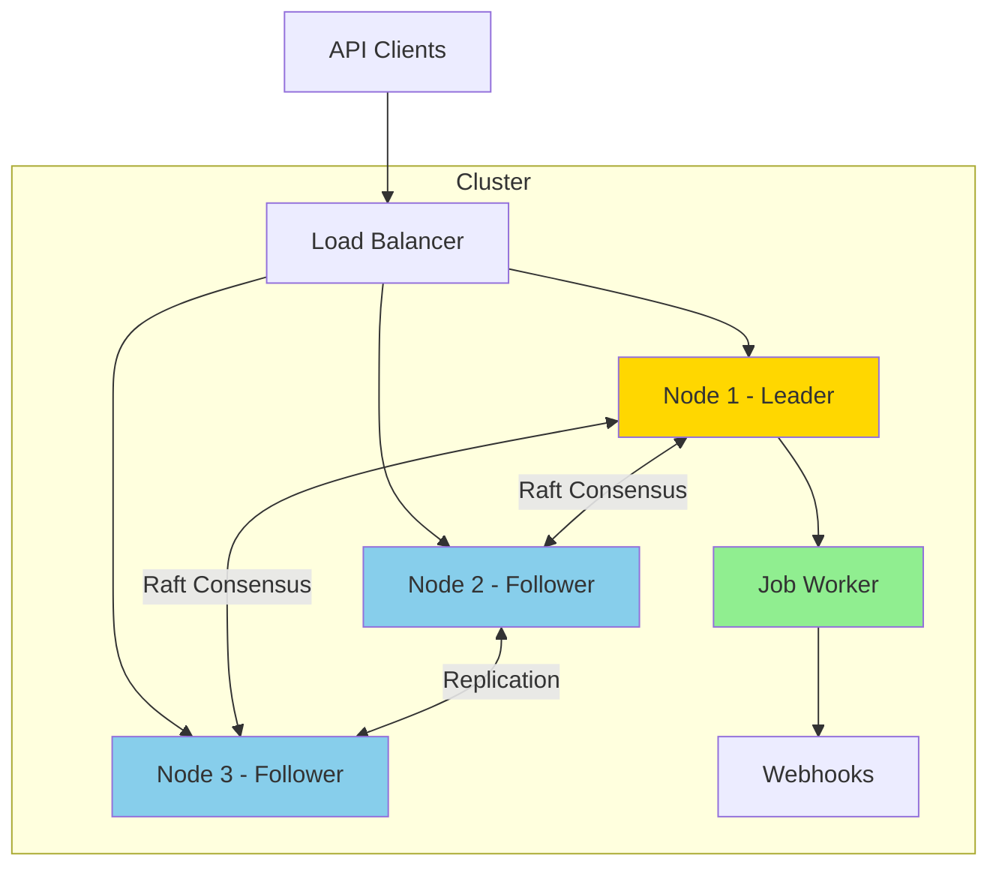

# Scheduled-DB

A distributed job scheduling system built on Raft consensus. Provides reliable, fault-tolerant job execution across a cluster of nodes with automatic leader election and failover.

## ✨ Features

- **Distributed Consensus** - Built on HashiCorp Raft for strong consistency
- **Two Job Types**
  - **Unico**: One-time execution at specific timestamp
  - **Recurrente**: Recurring execution with cron expressions
- **Time-Slotted Scheduling** - Efficient job organization and execution
- **Queue Size Limits** - Memory-based capacity management with configurable limits
- **Job Status Tracking** - Comprehensive execution state management with history
- **Idempotency Guarantees** - Prevents duplicate execution during failover
- **High Availability** - Automatic failover and graceful leader resignation
- **Service Discovery** - Multiple strategies (Kubernetes, DNS, Gossip, Static)
- **Observability** - Prometheus metrics and OpenTelemetry integration
- **RESTful API** - Simple HTTP interface for job management

## 🚀 Quick Start

### Docker Compose (Recommended for Development)

```bash
# Start 3-node cluster with load balancer
make dev-up

# Create a test job
curl -X POST http://localhost:80/jobs \
  -H "Content-Type: application/json" \
  -d '{
    "type": "unico",
    "timestamp": "2024-12-25T10:00:00Z",
    "webhook_url": "https://webhook.site/your-unique-id"
  }'

# Check cluster status
curl http://localhost:80/health | jq

# View logs
make dev-logs

# Stop cluster
make dev-down
```

**Access Points:**
- API (Load Balanced): http://localhost:80
- Node 1: http://localhost:8080
- Node 2: http://localhost:8081
- Node 3: http://localhost:8082
- Prometheus: http://localhost:9090
- Grafana: http://localhost:3000 (admin/admin)

### Kubernetes

```bash
# Deploy to Kubernetes
make k8s-deploy

# Check status
kubectl get pods -l app=scheduled-db

# Port forward for local access
kubectl port-forward svc/scheduled-db-api 8080:8080

# Create a job
curl -X POST http://localhost:8080/jobs \
  -H "Content-Type: application/json" \
  -d '{
    "type": "recurrente",
    "cron_expression": "0 0 * * *"
  }'
```

### Local Binary

```bash
# Build
make build

# Run single node
./scheduled-db --node-id=node-1

# Run with custom config
./scheduled-db \
  --node-id=node-1 \
  --http-port=8080 \
  --raft-port=7000 \
  --data-dir=./data \
  --slot-gap=10s
```

## 📖 Documentation

Comprehensive documentation is available in the [`docs/`](./docs/) directory:

- **[Documentation Index](./docs/README.md)** - Start here
- **[Architecture](./docs/architecture.md)** - System design and diagrams
- **[Development Guide](./docs/development-guide.md)** - Developer handbook
- **[API Reference](./docs/api-reference.md)** - Complete API documentation

## 🎯 Usage Examples

### One-Time Job

Execute once at a specific time:

```bash
curl -X POST http://localhost:8080/jobs \
  -H "Content-Type: application/json" \
  -d '{
    "type": "unico",
    "timestamp": "2024-12-25T10:00:00Z",
    "webhook_url": "https://example.com/webhook",
    "payload": {
      "message": "Merry Christmas!"
    }
  }'
```

### Recurring Job

Execute on a schedule:

```bash
# Daily at midnight
curl -X POST http://localhost:8080/jobs \
  -H "Content-Type: application/json" \
  -d '{
    "type": "recurrente",
    "cron_expression": "0 0 * * *",
    "webhook_url": "https://example.com/daily-report"
  }'

# Every 15 minutes
curl -X POST http://localhost:8080/jobs \
  -H "Content-Type: application/json" \
  -d '{
    "type": "recurrente",
    "cron_expression": "*/15 * * * *"
  }'

# Weekdays at 9 AM, until end of year
curl -X POST http://localhost:8080/jobs \
  -H "Content-Type: application/json" \
  -d '{
    "type": "recurrente",
    "cron_expression": "0 9 * * 1-5",
    "last_date": "2024-12-31T23:59:59Z"
  }'
```

### Job Status Tracking

Monitor job execution status and history:

```bash
# Check job status
curl http://localhost:8080/jobs/{job-id}/status | jq

# View execution history
curl http://localhost:8080/jobs/{job-id}/executions | jq

# List jobs by status
curl http://localhost:8080/jobs?status=completed | jq
curl http://localhost:8080/jobs?status=failed | jq

# Cancel a job
curl -X POST http://localhost:8080/jobs/{job-id}/cancel \
  -H "Content-Type: application/json" \
  -d '{"reason": "No longer needed"}'
```

## 🏗️ Architecture



**Key Components:**
- **HTTP API** - RESTful interface for job management
- **Raft Consensus** - Distributed state management
- **Slot Queue** - Time-based job organization
- **Worker** - Job execution engine (leader-only)
- **Service Discovery** - Automatic cluster formation

See [Architecture Documentation](./docs/architecture.md) for details.

## 🛠️ Development

### Prerequisites

- Go 1.23+ (toolchain 1.24.2)
- Docker and Docker Compose
- kubectl (for Kubernetes)
- make

### Building

```bash
# Build binary
make build

# Build for multiple platforms
make build-all

# Build Docker image
make docker-build
```

### Testing

```bash
# Run all tests
make test

# Run with coverage
make test
go tool cover -html=coverage.out

# Run specific package
go test -v ./internal/store
```

### Code Quality

```bash
# Format code
make fmt

# Run linter
make lint

# Tidy dependencies
make mod
```

## 📊 Monitoring

### Metrics

Prometheus metrics exposed on port 9090:

```bash
curl http://localhost:9090/metrics
```

**Available Metrics:**
- Job creation/deletion rates
- Job execution success/failure
- Queue memory usage and limits
- Job count and capacity
- Job rejections by reason
- Raft cluster health
- Leader election events
- Slot queue size
- Worker processing time

### Logging

Structured logging with configurable levels:

```bash
# Debug mode
LOG_LEVEL=DEBUG ./scheduled-db

# Info mode (default)
LOG_LEVEL=INFO ./scheduled-db

# Errors only
LOG_LEVEL=ERROR ./scheduled-db
```

## 🔧 Configuration

### Environment Variables

| Variable | Default | Description |
|----------|---------|-------------|
| `NODE_ID` | `node-1` | Unique node identifier |
| `HTTP_PORT` | `8080` | HTTP API port |
| `RAFT_PORT` | `7000` | Raft communication port |
| `DATA_DIR` | `./data` | Data directory |
| `SLOT_GAP` | `10s` | Slot interval |
| `LOG_LEVEL` | `INFO` | Log level |
| `DISCOVERY_STRATEGY` | `` | Discovery method |
| `JOB_EXECUTION_TIMEOUT` | `5m` | Webhook execution timeout |
| `JOB_INPROGRESS_TIMEOUT` | `5m` | In-progress job timeout |
| `MAX_EXECUTION_ATTEMPTS` | `3` | Maximum retry attempts |
| `EXECUTION_HISTORY_RETENTION` | `30d` | History retention period |
| `HEALTH_FAILURE_THRESHOLD` | `0.1` | Health check failure ratio |
| `QUEUE_MEMORY_LIMIT` | `` | Memory limit (e.g., "2GB", "500MB") |
| `QUEUE_MEMORY_PERCENT` | `50` | Memory percentage if limit not set |
| `QUEUE_JOB_LIMIT` | `100000` | Maximum number of jobs |

### Command-Line Flags

```bash
./scheduled-db \
  --node-id=node-1 \
  --http-port=8080 \
  --raft-port=7000 \
  --data-dir=./data \
  --slot-gap=10s \
  --discovery-strategy=kubernetes
```

## 🐳 Deployment

### Docker Compose

```bash
make dev-up      # Start cluster
make dev-down    # Stop cluster
make dev-logs    # View logs
```

### Kubernetes

```bash
make k8s-deploy  # Deploy
make k8s-delete  # Remove
make k8s-status  # Check status
make k8s-logs    # View logs
```

See [Development Guide](./docs/development-guide.md) for detailed deployment instructions.

## 🧪 Testing the Cluster

```bash
# Create test jobs
make create-jobs

# Test proxy functionality
make test-proxy

# Test failover
make test-failover

# Show cluster info
make cluster-info
```

## 🤝 Contributing

1. Read the [Development Guide](./docs/development-guide.md)
2. Follow [Code Style Guidelines](./docs/development-guide.md#code-style-and-conventions)
3. Write tests for new features
4. Update documentation
5. Submit a pull request

## 📝 API Endpoints

| Method | Endpoint | Description |
|--------|----------|-------------|
| POST | `/jobs` | Create job |
| GET | `/jobs/{id}` | Get job details |
| DELETE | `/jobs/{id}` | Delete job |
| GET | `/jobs/{id}/status` | Get job execution status |
| GET | `/jobs/{id}/executions` | Get execution history |
| GET | `/jobs?status={status}` | List jobs by status |
| POST | `/jobs/{id}/cancel` | Cancel job |
| GET | `/health` | Health check |
| GET | `/debug/cluster` | Cluster info |
| POST | `/join` | Join cluster |

See [API Reference](./docs/api-reference.md) for complete documentation.

## 🔍 Troubleshooting

### Common Issues

**No leader elected**
```bash
# Check cluster configuration
curl http://localhost:8080/debug/cluster | jq

# Verify network connectivity between nodes
```

**Jobs not executing**
```bash
# Verify node is leader
curl http://localhost:8080/health | jq '.role'

# Check job timestamp is in future
curl http://localhost:8080/jobs/{job-id} | jq '.timestamp'

# Check job status
curl http://localhost:8080/jobs/{job-id}/status | jq
```

**Job stuck in "in_progress" status**
```bash
# Check if job timed out
curl http://localhost:8080/jobs/{job-id}/status | jq '.status'

# View execution history for errors
curl http://localhost:8080/jobs/{job-id}/executions | jq

# Adjust timeout if needed
export JOB_INPROGRESS_TIMEOUT=10m
```

**Duplicate job executions**
```bash
# Status tracking prevents duplicates automatically
# Check execution history to verify
curl http://localhost:8080/jobs/{job-id}/executions | jq

# Verify idempotency is working
curl http://localhost:8080/jobs/{job-id}/status | jq '.attempt_count'
```

**Failed job executions**
```bash
# View execution history with error details
curl http://localhost:8080/jobs/{job-id}/executions | jq

# Check error type and message
curl http://localhost:8080/jobs/{job-id}/status | jq

# Common error types:
# - timeout: Webhook took too long
# - connection_error: Cannot reach webhook
# - dns_error: Cannot resolve webhook hostname
# - http_error: Webhook returned error status
```

**High failure rate**
```bash
# Check health endpoint for failure metrics
curl http://localhost:8080/health | jq

# List all failed jobs
curl http://localhost:8080/jobs?status=failed | jq

# Check Prometheus metrics
curl http://localhost:9090/metrics | grep execution_failures
```

**Job creation rejected with 507 error**
```bash
# Check memory usage
curl http://localhost:8080/health | jq '.memory'

# Check job count
curl http://localhost:8080/health | jq '.jobs'

# View capacity metrics
curl http://localhost:9090/metrics | grep queue_memory
curl http://localhost:9090/metrics | grep queue_job

# Increase limits if needed
export QUEUE_MEMORY_LIMIT=4GB
export QUEUE_JOB_LIMIT=200000

# Or scale horizontally by adding nodes
```

**Memory utilization high**
```bash
# Check current utilization
curl http://localhost:8080/health | jq '.memory.utilization_percent'

# Delete old completed jobs
curl -X DELETE http://localhost:8080/jobs/{old-job-id}

# Monitor rejection rate
curl http://localhost:9090/metrics | grep job_rejections_total

# Consider increasing memory limit
export QUEUE_MEMORY_LIMIT=4GB
```

**Split-brain detected**
```bash
# Check all nodes can communicate
# Restart affected nodes
# Verify cluster configuration
```

See [Debugging Guide](./docs/development-guide.md#debugging) for more solutions.

## 📚 Resources

### Documentation
- [Architecture Overview](./docs/architecture.md)
- [Development Guide](./docs/development-guide.md)
- [API Reference](./docs/api-reference.md)

### External Links
- [Raft Consensus Algorithm](https://raft.github.io/)
- [HashiCorp Raft](https://github.com/hashicorp/raft)
- [Cron Expression Guide](https://crontab.guru/)

## 📄 License

See LICENSE file for details.

## 🙏 Acknowledgments

Built with:
- [HashiCorp Raft](https://github.com/hashicorp/raft)
- [Gorilla Mux](https://github.com/gorilla/mux)
- [Robfig Cron](https://github.com/robfig/cron)
- [Prometheus](https://prometheus.io/)
- [OpenTelemetry](https://opentelemetry.io/)

---

**Made with ❤️ for distributed systems**
