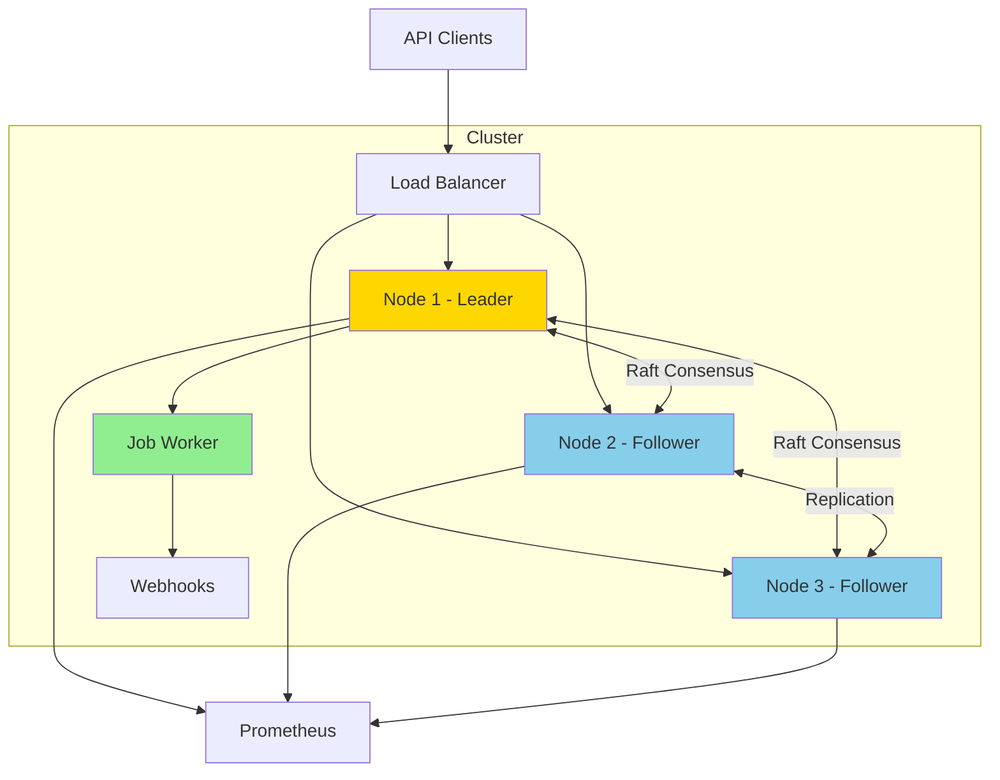

# Scheduled-DB Documentation

Welcome to the scheduled-db documentation! This directory contains comprehensive guides and references for understanding, developing, and deploying scheduled-db.

## 📚 Documentation Index

### Getting Started

- **[Development Guide](./development-guide.md)** - Complete guide for developers
  - Project structure
  - Building and running
  - Testing
  - Code style and conventions
  - Debugging tips

### Architecture

- **[Architecture Overview](./architecture.md)** - System architecture and design
  - High-level architecture diagrams
  - Component descriptions
  - Data flow diagrams
  - State management
  - Leadership and failover
  - Deployment architectures
  - Performance characteristics

### API

- **[API Reference](./api-reference.md)** - Complete API documentation
  - Endpoint specifications
  - Request/response formats
  - Data types
  - Cron expressions
  - Webhook execution
  - Error codes
  - Client examples

## 🚀 Quick Links

### For Developers

1. [Project Structure](./development-guide.md#project-structure)
2. [Building Locally](./development-guide.md#local-development)
3. [Running Tests](./development-guide.md#running-tests)
4. [Code Style](./development-guide.md#code-style-and-conventions)
5. [Contributing](./development-guide.md#contributing)

### For Operators

1. [Docker Deployment](./development-guide.md#docker-compose-cluster)
2. [Kubernetes Deployment](./development-guide.md#kubernetes-deployment)
3. [Configuration](./development-guide.md#configuration)
4. [Monitoring](./architecture.md#monitoring-and-observability)
5. [Troubleshooting](./development-guide.md#debugging)

### For API Users

1. [Creating Jobs](./api-reference.md#create-job)
2. [Job Types](./api-reference.md#job-types)
3. [Cron Expressions](./api-reference.md#cron-expression-format)
4. [Webhooks](./api-reference.md#webhook-execution)
5. [Error Handling](./api-reference.md#error-codes)

## 🏗️ Architecture at a Glance



## 🎯 Key Concepts

### Jobs

**Unico (One-Time)**: Execute once at a specific timestamp
```json
{
  "type": "unico",
  "timestamp": "2024-12-25T10:00:00Z"
}
```

**Recurrente (Recurring)**: Execute repeatedly based on cron expression
```json
{
  "type": "recurrente",
  "cron_expression": "0 0 * * *"
}
```

### Slots

Jobs are organized into time-based slots for efficient scheduling:
- Configurable slot gap (default: 10 seconds)
- Min-heap based priority queue
- Persistent across restarts

### Raft Consensus

- **Leader**: Processes jobs, manages state
- **Followers**: Replicate state, ready for failover
- **Quorum**: Majority (2/3) required for writes

## 📖 Common Tasks

### Create a One-Time Job

```bash
curl -X POST http://localhost:8080/jobs \
  -H "Content-Type: application/json" \
  -d '{
    "type": "unico",
    "timestamp": "2024-12-25T10:00:00Z",
    "webhook_url": "https://example.com/webhook"
  }'
```

### Create a Recurring Job

```bash
curl -X POST http://localhost:8080/jobs \
  -H "Content-Type: application/json" \
  -d '{
    "type": "recurrente",
    "cron_expression": "0 0 * * *"
  }'
```

### Check Cluster Health

```bash
curl http://localhost:8080/health | jq
```

### View Cluster Status

```bash
curl http://localhost:8080/debug/cluster | jq
```

## 🔧 Development Workflow

```bash
# 1. Clone and build
git clone <repository>
cd scheduled-db
make build

# 2. Run tests
make test

# 3. Start local cluster
make dev-up

# 4. Create test jobs
make create-jobs

# 5. View logs
make dev-logs

# 6. Stop cluster
make dev-down
```

## 🐳 Docker Quick Start

```bash
# Start 3-node cluster
make dev-up

# Access points:
# - API: http://localhost:80
# - Node 1: http://localhost:8080
# - Node 2: http://localhost:8081
# - Node 3: http://localhost:8082
# - Prometheus: http://localhost:9090
# - Grafana: http://localhost:3000
```

## ☸️ Kubernetes Quick Start

```bash
# Deploy to Kubernetes
make k8s-deploy

# Check status
kubectl get pods -l app=scheduled-db

# Port forward
kubectl port-forward svc/scheduled-db-api 8080:8080

# Create job
curl -X POST http://localhost:8080/jobs \
  -H "Content-Type: application/json" \
  -d '{"type":"unico","timestamp":"2024-12-25T10:00:00Z"}'
```

## 🧪 Testing

```bash
# Run all tests
make test

# Run specific package
go test -v ./internal/store

# Run with coverage
make test
go tool cover -html=coverage.out
```

## 📊 Monitoring

### Metrics

Prometheus metrics on port 9090:
- Job creation/deletion rates
- Job execution success/failure
- Raft cluster health
- Leader election events
- Slot queue size

### Logging

Structured logging with levels:
```bash
LOG_LEVEL=DEBUG ./scheduled-db  # All logs
LOG_LEVEL=INFO ./scheduled-db   # Default
LOG_LEVEL=ERROR ./scheduled-db  # Errors only
```

## 🔍 Troubleshooting

### Common Issues

| Issue | Solution |
|-------|----------|
| No leader elected | Check network connectivity, verify quorum |
| Jobs not executing | Verify node is leader, check timestamps |
| Split-brain detected | Check cluster configuration, restart nodes |
| High latency | Tune Raft timeouts, check network |

See [Development Guide - Debugging](./development-guide.md#debugging) for details.

## 🤝 Contributing

1. Read [Development Guide](./development-guide.md)
2. Follow [Code Style](./development-guide.md#code-style-and-conventions)
3. Write tests for new features
4. Update documentation
5. Submit pull request

## 📝 Additional Resources

### Internal Documentation

- [Logging Standards](../.kiro/steering/logging.md)
- [Project Structure](../.kiro/steering/structure.md)
- [Tech Stack](../.kiro/steering/tech.md)
- [Product Overview](../.kiro/steering/product.md)

### External Resources

- [Raft Consensus Algorithm](https://raft.github.io/)
- [HashiCorp Raft](https://github.com/hashicorp/raft)
- [Cron Expression Guide](https://crontab.guru/)
- [Kubernetes StatefulSets](https://kubernetes.io/docs/concepts/workloads/controllers/statefulset/)

## 📧 Support

For questions or issues:
1. Check documentation
2. Review [troubleshooting guide](./development-guide.md#debugging)
3. Open an issue in the repository

## 📄 License

See LICENSE file in the root directory.

---

**Last Updated:** 2024
**Version:** 1.0.0
