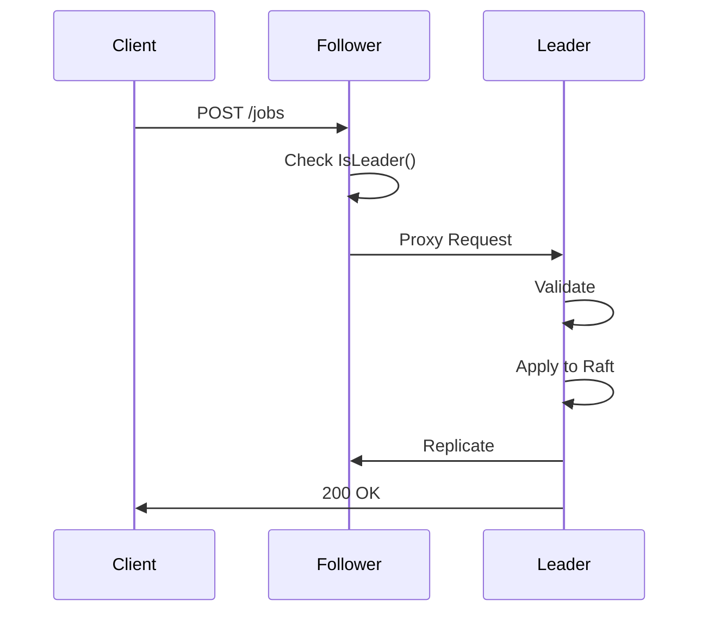
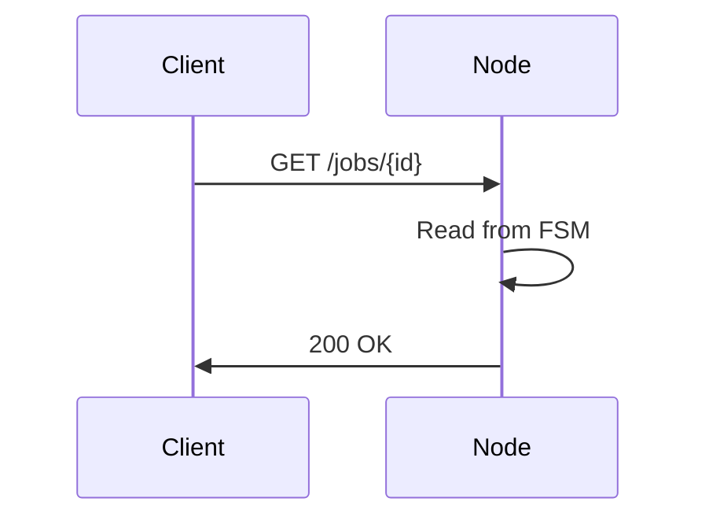

# API Reference

## Base URL

```
http://<node-address>:8080
```

## Authentication

Currently, the API does not require authentication. For production deployments, consider adding:
- API keys
- JWT tokens
- mTLS
- Network policies

## Endpoints

### Create Job

Create a new scheduled job.

**Endpoint:** `POST /jobs`

**Request Body:**

```json
{
  "id": "optional-custom-id",
  "type": "unico|recurrente",
  "timestamp": "RFC3339 or epoch seconds",
  "cron_expression": "cron format (for recurrente)",
  "last_date": "RFC3339 or epoch seconds (optional)",
  "webhook_url": "https://example.com/webhook (optional)",
  "payload": {
    "custom": "data"
  }
}
```

**Response:** `200 OK`

```json
{
  "id": "550e8400-e29b-41d4-a716-446655440000",
  "type": "unico",
  "timestamp": 1704067200,
  "created_at": 1704060000,
  "webhook_url": "https://example.com/webhook",
  "payload": {
    "custom": "data"
  }
}
```

**Examples:**

```bash
# One-time job
curl -X POST http://localhost:8080/jobs \
  -H "Content-Type: application/json" \
  -d '{
    "type": "unico",
    "timestamp": "2024-12-25T10:00:00Z",
    "webhook_url": "https://example.com/webhook"
  }'

# Recurring job (daily at midnight)
curl -X POST http://localhost:8080/jobs \
  -H "Content-Type: application/json" \
  -d '{
    "type": "recurrente",
    "cron_expression": "0 0 * * *"
  }'

# Recurring job with end date
curl -X POST http://localhost:8080/jobs \
  -H "Content-Type: application/json" \
  -d '{
    "type": "recurrente",
    "cron_expression": "0 9 * * 1-5",
    "last_date": "2024-12-31T23:59:59Z"
  }'
```

**Error Responses:**

```json
// 400 Bad Request - Invalid input
{
  "error": "timestamp is required for unico jobs"
}

// 500 Internal Server Error - Server error
{
  "error": "failed to create job: raft error"
}

// 503 Service Unavailable - No leader
{
  "error": "No leader available"
}
```

---

### Get Job

Retrieve job details by ID.

**Endpoint:** `GET /jobs/{id}`

**Response:** `200 OK`

```json
{
  "id": "550e8400-e29b-41d4-a716-446655440000",
  "type": "unico",
  "timestamp": 1704067200,
  "created_at": 1704060000,
  "webhook_url": "https://example.com/webhook",
  "payload": {
    "custom": "data"
  }
}
```

**Example:**

```bash
curl http://localhost:8080/jobs/550e8400-e29b-41d4-a716-446655440000
```

**Error Responses:**

```json
// 404 Not Found
{
  "error": "Job not found"
}

// 400 Bad Request
{
  "error": "Job ID is required"
}
```

---

### Delete Job

Delete a scheduled job.

**Endpoint:** `DELETE /jobs/{id}`

**Response:** `200 OK` (empty body)

**Example:**

```bash
curl -X DELETE http://localhost:8080/jobs/550e8400-e29b-41d4-a716-446655440000
```

**Error Responses:**

```json
// 404 Not Found
{
  "error": "Job not found"
}

// 500 Internal Server Error
{
  "error": "Failed to delete job: raft error"
}
```

---

### Health Check

Get node health and cluster role.

**Endpoint:** `GET /health`

**Response:** `200 OK`

```json
{
  "status": "ok",
  "role": "leader",
  "node_id": "node-1",
  "leader": ""
}
```

For follower nodes:

```json
{
  "status": "ok",
  "role": "follower",
  "node_id": "node-2",
  "leader": "node-1:7000"
}
```

**Example:**

```bash
curl http://localhost:8080/health
```

---

### Cluster Debug

Get detailed cluster information (for debugging).

**Endpoint:** `GET /debug/cluster`

**Response:** `200 OK`

```json
{
  "node_id": "node-1",
  "is_leader": true,
  "leader": "node-1:7000",
  "raft_state": "Leader",
  "servers": [
    {
      "id": "node-1",
      "address": "node-1:7000"
    },
    {
      "id": "node-2",
      "address": "node-2:7000"
    },
    {
      "id": "node-3",
      "address": "node-3:7000"
    }
  ],
  "job_count": 42
}
```

**Example:**

```bash
curl http://localhost:8080/debug/cluster | jq
```

---

### Join Cluster

Manually add a node to the cluster (typically handled by service discovery).

**Endpoint:** `POST /join`

**Request Body:**

```json
{
  "node_id": "node-4",
  "address": "node-4:7000"
}
```

**Response:** `200 OK`

```json
{
  "success": true,
  "message": "Node node-4 successfully joined cluster"
}
```

**Example:**

```bash
curl -X POST http://localhost:8080/join \
  -H "Content-Type: application/json" \
  -d '{
    "node_id": "node-4",
    "address": "node-4:7000"
  }'
```

**Error Responses:**

```json
// 403 Forbidden - Not leader
{
  "error": "not leader, cannot accept join requests"
}

// 400 Bad Request
{
  "error": "node_id and address are required"
}
```

---

## Data Types

### Job Types

#### Unico (One-Time)

Executes once at the specified timestamp.

**Required Fields:**
- `type`: `"unico"`
- `timestamp`: Future timestamp (RFC3339 or epoch)

**Optional Fields:**
- `id`: Custom job ID (auto-generated if not provided)
- `webhook_url`: URL to call when job executes
- `payload`: Custom data to include in webhook

**Example:**

```json
{
  "type": "unico",
  "timestamp": "2024-12-25T10:00:00Z",
  "webhook_url": "https://example.com/webhook",
  "payload": {
    "event": "christmas",
    "year": 2024
  }
}
```

#### Recurrente (Recurring)

Executes repeatedly based on cron expression.

**Required Fields:**
- `type`: `"recurrente"`
- `cron_expression`: Valid cron expression

**Optional Fields:**
- `id`: Custom job ID
- `timestamp`: First execution time (defaults to now)
- `last_date`: Stop executing after this date
- `webhook_url`: URL to call on each execution
- `payload`: Custom data

**Example:**

```json
{
  "type": "recurrente",
  "cron_expression": "0 9 * * 1-5",
  "last_date": "2024-12-31T23:59:59Z",
  "webhook_url": "https://example.com/daily-report"
}
```

### Timestamp Formats

The API accepts multiple timestamp formats:

#### RFC3339 (Recommended)

```
2024-12-25T10:00:00Z
2024-12-25T10:00:00+02:00
2024-12-25T10:00:00-05:00
```

#### Epoch Seconds

```
1704067200
```

#### Simple DateTime

```
2024-12-25 10:00:00
```

### Cron Expression Format

Standard cron format with 5 fields:

```
* * * * *
│ │ │ │ │
│ │ │ │ └─── Day of week (0-6, Sunday=0)
│ │ │ └───── Month (1-12)
│ │ └─────── Day of month (1-31)
│ └───────── Hour (0-23)
└─────────── Minute (0-59)
```

**Examples:**

```bash
"0 0 * * *"      # Daily at midnight
"*/15 * * * *"   # Every 15 minutes
"0 9 * * 1-5"    # Weekdays at 9 AM
"0 0 1 * *"      # First day of month at midnight
"0 */6 * * *"    # Every 6 hours
```

**Tools:**
- [Crontab Guru](https://crontab.guru/) - Cron expression editor
- [Cron Expression Generator](https://www.freeformatter.com/cron-expression-generator-quartz.html)

## Webhook Execution

When a job executes, if `webhook_url` is configured, the system will make an HTTP POST request:

**Request:**

```http
POST {webhook_url}
Content-Type: application/json

{
  "job_id": "550e8400-e29b-41d4-a716-446655440000",
  "type": "unico",
  "executed_at": 1704067200,
  "payload": {
    "custom": "data"
  }
}
```

**Expected Response:**

Any 2xx status code indicates success. Non-2xx responses are logged as failures.

## Request/Response Flow

### Write Operations (Create/Delete)



### Read Operations (Get)



## Rate Limiting

Currently, no rate limiting is implemented. For production:

- Implement rate limiting middleware
- Use API gateway (Kong, Traefik)
- Configure Kubernetes Ingress rate limits

## Error Codes

| Code | Meaning | Common Causes |
|------|---------|---------------|
| 200 | OK | Request successful |
| 400 | Bad Request | Invalid input, validation error |
| 403 | Forbidden | Not leader, cannot perform operation |
| 404 | Not Found | Job ID doesn't exist |
| 500 | Internal Server Error | Raft error, database error |
| 503 | Service Unavailable | No leader elected |

## Best Practices

### Job IDs

- Let the system generate UUIDs for you
- Only provide custom IDs if you need idempotency
- Use meaningful IDs for debugging: `daily-report-2024-12-25`

### Timestamps

- Always use RFC3339 format for clarity
- Include timezone information
- Ensure timestamps are in the future for unico jobs

### Cron Expressions

- Test expressions before deploying
- Use `last_date` to prevent infinite execution
- Consider timezone implications

### Webhooks

- Implement idempotency in webhook handlers
- Return 2xx quickly, process asynchronously
- Handle retries gracefully
- Log webhook responses for debugging

### Error Handling

- Always check response status codes
- Implement retry logic with exponential backoff
- Log errors for debugging
- Handle 503 (no leader) by retrying

## Examples

### Complete Job Lifecycle

```bash
# 1. Create job
JOB_ID=$(curl -s -X POST http://localhost:8080/jobs \
  -H "Content-Type: application/json" \
  -d '{
    "type": "unico",
    "timestamp": "'$(date -u -v+1H +%Y-%m-%dT%H:%M:%SZ)'",
    "webhook_url": "https://webhook.site/unique-id"
  }' | jq -r '.id')

echo "Created job: $JOB_ID"

# 2. Get job details
curl http://localhost:8080/jobs/$JOB_ID | jq

# 3. Wait for execution...
# (Job will execute at specified timestamp)

# 4. Delete job (if needed before execution)
curl -X DELETE http://localhost:8080/jobs/$JOB_ID
```

### Batch Job Creation

```bash
# Create multiple jobs
for i in {1..10}; do
  TIMESTAMP=$(date -u -v+${i}M +%Y-%m-%dT%H:%M:%SZ)
  curl -X POST http://localhost:8080/jobs \
    -H "Content-Type: application/json" \
    -d "{
      \"type\": \"unico\",
      \"timestamp\": \"$TIMESTAMP\",
      \"payload\": {\"batch\": $i}
    }"
  echo ""
done
```

### Monitoring Job Execution

```bash
# Check cluster health
watch -n 1 'curl -s http://localhost:8080/health | jq'

# Monitor job count
watch -n 1 'curl -s http://localhost:8080/debug/cluster | jq .job_count'
```

## Client Libraries

### Go

```go
package main

import (
    "bytes"
    "encoding/json"
    "net/http"
    "time"
)

type Job struct {
    Type       string                 `json:"type"`
    Timestamp  string                 `json:"timestamp,omitempty"`
    CronExpr   string                 `json:"cron_expression,omitempty"`
    WebhookURL string                 `json:"webhook_url,omitempty"`
    Payload    map[string]interface{} `json:"payload,omitempty"`
}

func CreateJob(baseURL string, job *Job) error {
    data, _ := json.Marshal(job)
    resp, err := http.Post(
        baseURL+"/jobs",
        "application/json",
        bytes.NewBuffer(data),
    )
    if err != nil {
        return err
    }
    defer resp.Body.Close()
    return nil
}

func main() {
    job := &Job{
        Type:      "unico",
        Timestamp: time.Now().Add(1 * time.Hour).Format(time.RFC3339),
    }
    CreateJob("http://localhost:8080", job)
}
```

### Python

```python
import requests
from datetime import datetime, timedelta

def create_job(base_url, job_data):
    response = requests.post(
        f"{base_url}/jobs",
        json=job_data
    )
    return response.json()

# One-time job
job = {
    "type": "unico",
    "timestamp": (datetime.now() + timedelta(hours=1)).isoformat() + "Z",
    "webhook_url": "https://example.com/webhook"
}

result = create_job("http://localhost:8080", job)
print(f"Created job: {result['id']}")
```

### JavaScript/Node.js

```javascript
const axios = require('axios');

async function createJob(baseURL, jobData) {
  const response = await axios.post(`${baseURL}/jobs`, jobData);
  return response.data;
}

// Recurring job
const job = {
  type: 'recurrente',
  cron_expression: '0 0 * * *',
  webhook_url: 'https://example.com/webhook'
};

createJob('http://localhost:8080', job)
  .then(result => console.log('Created job:', result.id))
  .catch(error => console.error('Error:', error));
```

## Metrics Endpoint

Prometheus metrics are exposed on port 9090:

```bash
curl http://localhost:9090/metrics
```

See [Monitoring Guide](./monitoring-guide.md) for details.
