# Architecture Analysis: Weaknesses, Improvements & Explanations

## Executive Summary

Scheduled-DB is a distributed job scheduling system with a solid foundation built on Raft consensus. However, there are several architectural weaknesses that could impact reliability, scalability, and operational complexity in production environments. This document provides a comprehensive analysis of these issues with concrete improvement recommendations.

## 🔴 Critical Weaknesses

### 1. Single Leader Bottleneck

**Current State:**
```go
// Only the leader executes jobs
if a.store.IsLeader() {
    a.becomeLeader()  // Start worker
}
```

**Problem:**
- **ALL job execution happens on a single node** (the leader)
- If the leader is processing 1000 jobs/sec, followers sit idle
- Leader failure means ALL job execution stops until new leader is elected
- No horizontal scalability for job execution

**Impact:**
- ⚠️ **Throughput Ceiling**: Limited by single node capacity
- ⚠️ **Resource Waste**: Follower nodes don't execute jobs
- ⚠️ **Failover Delay**: Jobs pause during leader election (5-10 seconds)

**Improvement:**
```
Option 1: Distributed Worker Pool
- Leader assigns jobs to followers
- Each node executes jobs independently
- Leader coordinates but doesn't execute

Option 2: Sharded Execution
- Partition jobs by hash(job_id) % num_nodes
- Each node responsible for its shard
- Leader only manages state, not execution

Option 3: Hybrid Approach
- Leader executes jobs locally
- Also delegates to followers via work queue
- Best of both worlds
```

**Recommended Solution:**
Implement a distributed worker pool where the leader acts as a coordinator:


---

### 2. No Webhook Retry Mechanism

**Current State:**
```go
func ExecuteWebhook(job *Job) {
    go func() {
        client := &http.Client{Timeout: 30 * time.Second}
        resp, err := client.Post(job.WebhookURL, "application/json", bytes.NewBuffer(jsonData))
        if err != nil {
            logger.JobError(job.ID, "webhook request failed: %v", err)
            return  // ❌ Job lost forever!
        }
    }()
}
```

**Problem:**
- **Fire-and-forget**: If webhook fails, job is lost
- No retry logic
- No dead letter queue
- No way to recover failed jobs
- Transient network errors cause permanent job loss

**Impact:**
- ⚠️ **Data Loss**: Failed webhooks = lost jobs
- ⚠️ **No Reliability Guarantees**: Can't guarantee "at least once" delivery
- ⚠️ **Silent Failures**: Errors logged but not actionable

**Improvement:**
```go
type WebhookExecutor struct {
    maxRetries    int
    retryBackoff  time.Duration
    deadLetterQueue chan *Job
}

func (w *WebhookExecutor) ExecuteWithRetry(job *Job) error {
    for attempt := 0; attempt < w.maxRetries; attempt++ {
        if err := w.executeOnce(job); err == nil {
            return nil
        }
        
        // Exponential backoff
        time.Sleep(w.retryBackoff * time.Duration(1<<attempt))
    }
    
    // After all retries failed, send to DLQ
    w.deadLetterQueue <- job
    return fmt.Errorf("max retries exceeded")
}
```

**Recommended Solution:**
1. Implement exponential backoff retry (3-5 attempts)
2. Add dead letter queue for permanently failed jobs
3. Store webhook responses for debugging
4. Add webhook status endpoint: `GET /jobs/{id}/webhook-status`

---

### 3. No Job Execution Idempotency

**Current State:**
```go
func (w *Worker) executeJob(job *store.Job) {
    logger.Info("executed job %s", job.ID)
    store.ExecuteWebhook(job)  // ❌ No idempotency check
}
```

**Problem:**
- **Duplicate Execution Risk**: During leader failover, jobs might execute twice
- No execution tracking
- No way to prevent duplicate webhook calls
- Race conditions during leadership transitions

**Scenario:**
```
1. Leader A executes job at 10:00:00
2. Leader A crashes at 10:00:01 (before deleting job)
3. Leader B elected at 10:00:05
4. Leader B sees same job, executes again ❌
```

**Impact:**
- ⚠️ **Duplicate Webhooks**: Same job executed multiple times
- ⚠️ **Financial Risk**: Duplicate payments, notifications, etc.
- ⚠️ **Data Inconsistency**: External systems receive duplicate events

**Improvement:**
```go
type ExecutionLog struct {
    JobID       string
    ExecutedAt  int64
    ExecutedBy  string  // Node ID
    Status      string  // success, failed, in_progress
    AttemptNum  int
}

func (w *Worker) executeJob(job *store.Job) error {
    // Check if already executed
    if w.store.IsJobExecuted(job.ID) {
        logger.Info("job %s already executed, skipping", job.ID)
        return nil
    }
    
    // Mark as in-progress
    w.store.MarkJobInProgress(job.ID, w.nodeID)
    
    // Execute
    err := store.ExecuteWebhook(job)
    
    // Mark as complete
    w.store.MarkJobComplete(job.ID, err)
    
    return err
}
```

---

### 4. Slot Queue Memory Leak Risk

**Current State:**
```go
// Worker polls every 1 second
ticker := time.NewTicker(1 * time.Second)

// Only processes 10 slots per tick
maxSlotsToCheck := 10
```

**Problem:**
- **Unbounded Growth**: If jobs arrive faster than execution, queue grows forever
- **No Backpressure**: System accepts jobs even when overloaded
- **Memory Exhaustion**: Eventually OOM kills the process

**Scenario:**
```
Jobs arriving: 100/sec
Jobs executing: 50/sec
Net growth: +50 jobs/sec = +3000 jobs/min = +180k jobs/hour
```

**Impact:**
- ⚠️ **OOM Crashes**: Process killed by OS
- ⚠️ **Degraded Performance**: GC pressure from large heaps
- ⚠️ **Cascading Failures**: Crash triggers leader election, new leader inherits problem

**Improvement:**
```go
type SlotQueue struct {
    maxSize      int
    currentSize  int
    rejectedJobs metrics.Counter
}

func (sq *SlotQueue) AddJob(job *Job) error {
    if sq.currentSize >= sq.maxSize {
        sq.rejectedJobs.Inc()
        return ErrQueueFull
    }
    
    // Add job...
    sq.currentSize++
    return nil
}
```

**Recommended Solution:**
1. Add queue size limits (configurable)
2. Implement backpressure (reject new jobs when full)
3. Add queue size metrics and alerts
4. Consider priority queues for critical jobs

---

### 5. No Job Execution Timeout

**Current State:**
```go
func ExecuteWebhook(job *Job) {
    client := &http.Client{Timeout: 30 * time.Second}  // ❌ Only HTTP timeout
    // No overall job timeout
}
```

**Problem:**
- **Stuck Jobs**: Long-running webhooks block worker
- **Resource Leaks**: Goroutines never terminate
- **No Cancellation**: Can't stop runaway jobs

**Impact:**
- ⚠️ **Worker Starvation**: One slow job blocks all others
- ⚠️ **Goroutine Leaks**: Memory grows over time
- ⚠️ **Unpredictable Latency**: Jobs queue up behind slow ones

**Improvement:**
```go
func (w *Worker) executeJobWithTimeout(job *store.Job, timeout time.Duration) error {
    ctx, cancel := context.WithTimeout(context.Background(), timeout)
    defer cancel()
    
    done := make(chan error, 1)
    go func() {
        done <- store.ExecuteWebhook(ctx, job)
    }()
    
    select {
    case err := <-done:
        return err
    case <-ctx.Done():
        return fmt.Errorf("job execution timeout after %v", timeout)
    }
}
```

---

## 🟡 Moderate Weaknesses

### 6. Inefficient Slot Processing

**Current State:**
```go
// Polls every 1 second regardless of workload
ticker := time.NewTicker(1 * time.Second)

// Checks up to 10 slots per tick
for i := 0; i < maxSlotsToCheck; i++ {
    slot := w.slotQueue.GetNextSlot()
    // Process...
}
```

**Problem:**
- **Fixed Polling**: Wastes CPU when idle, slow when busy
- **Arbitrary Limit**: Why 10 slots? What if there are 100 ready?
- **No Adaptive Behavior**: Doesn't adjust to load

**Improvement:**
```go
// Event-driven approach
func (w *Worker) run() {
    for {
        select {
        case <-w.stopCh:
            return
        case <-w.slotQueue.ReadyNotification():
            // Process all ready slots
            w.processAllReadySlots()
        case <-time.After(1 * time.Second):
            // Fallback polling
            w.processAllReadySlots()
        }
    }
}
```

---

### 7. No Job Priority System

**Current State:**
```go
// All jobs treated equally
// FIFO processing based on timestamp only
```

**Problem:**
- **No Differentiation**: Critical jobs wait behind non-critical
- **No SLA Support**: Can't guarantee execution time for important jobs
- **No Resource Allocation**: All jobs compete equally

**Improvement:**
```go
type Job struct {
    ID       string
    Priority int  // 0=low, 1=normal, 2=high, 3=critical
    // ...
}

type PrioritySlotQueue struct {
    queues [4]*SlotQueue  // One per priority level
}

func (pq *PrioritySlotQueue) GetNextSlot() *Slot {
    // Check critical first, then high, normal, low
    for i := 3; i >= 0; i-- {
        if slot := pq.queues[i].GetNextSlot(); slot != nil {
            return slot
        }
    }
    return nil
}
```

---

### 8. Limited Observability

**Current State:**
```go
// Basic metrics exist but limited
logger.Info("executed job %s", job.ID)
```

**Missing:**
- Job execution duration histogram
- Queue depth over time
- Webhook success/failure rates
- Leader election frequency
- Slot processing latency
- Job age (time from creation to execution)

**Improvement:**
```go
type JobMetrics struct {
    ExecutionDuration   prometheus.Histogram
    QueueDepth          prometheus.Gauge
    WebhookSuccessRate  prometheus.Counter
    JobAge              prometheus.Histogram
    LeaderElections     prometheus.Counter
    SlotProcessingTime  prometheus.Histogram
}
```

---

### 9. No Job Cancellation API

**Current State:**
```go
// Can only DELETE jobs
// No way to cancel in-flight execution
```

**Problem:**
- **No Control**: Can't stop jobs once started
- **Resource Waste**: Can't cancel mistaken jobs
- **No Emergency Stop**: Can't halt runaway jobs

**Improvement:**
```go
// Add cancellation support
POST /jobs/{id}/cancel

type Job struct {
    ID          string
    Status      string  // pending, running, completed, cancelled
    CancelToken context.CancelFunc
}
```

---

### 10. Webhook Execution Lacks Context

**Current State:**
```go
func ExecuteWebhook(job *Job) {
    // No context propagation
    // No tracing
    // No correlation IDs
}
```

**Problem:**
- **No Distributed Tracing**: Can't track job through system
- **No Correlation**: Can't link webhook to job in logs
- **No Debugging**: Hard to troubleshoot failures

**Improvement:**
```go
func ExecuteWebhook(ctx context.Context, job *Job) error {
    // Add tracing
    span := trace.SpanFromContext(ctx)
    span.SetAttributes(
        attribute.String("job.id", job.ID),
        attribute.String("job.type", string(job.Type)),
    )
    
    // Add correlation ID to webhook
    req.Header.Set("X-Correlation-ID", job.ID)
    req.Header.Set("X-Trace-ID", span.SpanContext().TraceID().String())
    
    // Execute...
}
```

---

## 🟢 Minor Weaknesses

### 11. Hard-Coded Configuration

**Current State:**
```go
maxSlotsToCheck := 10  // Hard-coded
ticker := time.NewTicker(1 * time.Second)  // Hard-coded
client := &http.Client{Timeout: 30 * time.Second}  // Hard-coded
```

**Improvement:**
Make these configurable via environment variables or config file.

---

### 12. No Rate Limiting

**Current State:**
- No limits on job creation rate
- No limits on webhook call rate
- No protection against abuse

**Improvement:**
```go
type RateLimiter struct {
    jobsPerSecond    int
    webhooksPerSecond int
}
```

---

### 13. No Job Dependencies

**Current State:**
- Jobs execute independently
- No way to chain jobs
- No DAG support

**Improvement:**
```go
type Job struct {
    ID           string
    DependsOn    []string  // Job IDs that must complete first
    // ...
}
```

---

## 📊 Comparison: Current vs Improved Architecture

### Current Architecture Limitations

```mermaid
graph TB
    API[API] --> LEADER[Leader Only]
    LEADER --> WORKER[Single Worker]
    WORKER --> WEBHOOK[Webhooks]
    
    FOLLOWER1[Follower 1] -.->|Idle| X1[ ]
    FOLLOWER2[Follower 2] -.->|Idle| X2[ ]
    
    WEBHOOK -.->|Fails| LOST[Job Lost ❌]
    
    style LEADER fill:#FFD700
    style FOLLOWER1 fill:#87CEEB
    style FOLLOWER2 fill:#87CEEB
    style LOST fill:#FF6B6B
```



**Problems:**
- Single point of execution
- No fault tolerance for webhooks
- Wasted resources (idle followers)
- No horizontal scalability

### Improved Architecture


**Benefits:**
- Distributed execution
- Fault tolerance with retries
- All nodes utilized
- Horizontal scalability
- Failed jobs recoverable

---

## 🎯 Prioritized Improvement Roadmap

### Phase 1: Critical Reliability (Weeks 1-2)

1. **Webhook Retry Mechanism** ⭐⭐⭐
   - Exponential backoff
   - Dead letter queue
   - Status tracking

2. **Job Execution Idempotency** ⭐⭐⭐
   - Execution log
   - Duplicate detection
   - Status tracking

3. **Queue Size Limits** ⭐⭐⭐
   - Backpressure
   - Rejection handling
   - Metrics

### Phase 2: Scalability (Weeks 3-4)

4. **Distributed Worker Pool** ⭐⭐
   - Leader delegates to followers
   - Work distribution algorithm
   - Status reporting

5. **Job Execution Timeout** ⭐⭐
   - Context-based cancellation
   - Configurable timeouts
   - Timeout metrics

### Phase 3: Operational Excellence (Weeks 5-6)

6. **Enhanced Observability** ⭐⭐
   - Comprehensive metrics
   - Distributed tracing
   - Better logging

7. **Job Priority System** ⭐
   - Priority levels
   - Priority queues
   - SLA support

### Phase 4: Advanced Features (Weeks 7-8)

8. **Job Cancellation API** ⭐
   - Cancel endpoint
   - In-flight cancellation
   - Status updates

9. **Rate Limiting** ⭐
   - API rate limits
   - Webhook rate limits
   - Per-user quotas

---

## 💡 Architectural Patterns to Consider

### 1. Event Sourcing for Job History

Store all job state changes as events:
```go
type JobEvent struct {
    JobID     string
    EventType string  // created, started, completed, failed, cancelled
    Timestamp int64
    Data      map[string]interface{}
}
```

**Benefits:**
- Complete audit trail
- Replay capability
- Time-travel debugging

### 2. CQRS for Read/Write Separation

Separate read and write models:
```go
// Write model (Raft)
type JobWriteModel struct {
    CreateJob(job *Job) error
    DeleteJob(id string) error
}

// Read model (Optimized for queries)
type JobReadModel struct {
    GetJob(id string) (*Job, error)
    ListJobs(filter JobFilter) ([]*Job, error)
    GetJobHistory(id string) ([]JobEvent, error)
}
```

### 3. Circuit Breaker for Webhooks

Prevent cascading failures:
```go
type CircuitBreaker struct {
    failureThreshold int
    timeout          time.Duration
    state            string  // closed, open, half-open
}
```

---

## 🔧 Quick Wins (Can Implement Today)

1. **Add Queue Size Metric**
   ```go
   queueSize.Set(float64(len(slotQueue.slots)))
   ```

2. **Add Webhook Timeout Configuration**
   ```go
   timeout := getEnvDurationOrDefault("WEBHOOK_TIMEOUT", 30*time.Second)
   ```

3. **Add Job Age Metric**
   ```go
   jobAge := time.Now().Unix() - job.CreatedAt
   jobAgeHistogram.Observe(float64(jobAge))
   ```

4. **Add Execution Logging**
   ```go
   logger.Info("job %s executed in %v, status: %d", job.ID, duration, statusCode)
   ```

5. **Add Health Check Details**
   ```go
   {
     "status": "ok",
     "queue_size": 42,
     "jobs_executing": 5,
     "last_execution": "2024-01-01T00:00:00Z"
   }
   ```

---

## 📈 Expected Impact of Improvements

| Improvement | Reliability | Scalability | Ops Complexity |
|-------------|-------------|-------------|----------------|
| Webhook Retry | +40% | 0% | +10% |
| Idempotency | +30% | 0% | +15% |
| Distributed Workers | +20% | +300% | +25% |
| Queue Limits | +10% | 0% | +5% |
| Observability | +15% | 0% | -20% (easier debugging) |

---

## 🎓 Lessons Learned

### What Works Well

1. **Raft Consensus** - Solid foundation for distributed state
2. **Slot-Based Scheduling** - Efficient time-based organization
3. **Leader-Only Writes** - Simplifies consistency
4. **Graceful Shutdown** - Prevents job loss during restarts

### What Needs Improvement

1. **Single Leader Execution** - Scalability bottleneck
2. **Fire-and-Forget Webhooks** - Reliability issue
3. **No Backpressure** - Stability risk
4. **Limited Observability** - Operational challenge

### Key Takeaways

- **Distributed systems are hard** - Many edge cases to handle
- **Observability is critical** - Can't fix what you can't see
- **Reliability requires redundancy** - Single points of failure are dangerous
- **Scalability requires distribution** - Single leader won't scale

---

## 🤔 Discussion Questions

1. **Is strong consistency worth the scalability trade-off?**
   - Could we use eventual consistency for better performance?

2. **Should we support exactly-once delivery?**
   - Or is at-least-once with idempotency good enough?

3. **How do we handle webhook authentication?**
   - API keys? OAuth? mTLS?

4. **What's the target scale?**
   - 100 jobs/sec? 10,000 jobs/sec? 1M jobs/sec?

5. **Do we need multi-region support?**
   - How would that affect the architecture?

---

## 📚 References

- [Raft Consensus](https://raft.github.io/)
- [Designing Data-Intensive Applications](https://dataintensive.net/)
- [Google SRE Book](https://sre.google/books/)
- [AWS Well-Architected Framework](https://aws.amazon.com/architecture/well-architected/)
- [Microservices Patterns](https://microservices.io/patterns/)

---

**Document Version:** 1.0  
**Last Updated:** 2024  
**Author:** Architecture Review Team
