# Scheduled-DB Architecture

## Overview

Scheduled-DB is a distributed job scheduling system built on Raft consensus. It provides reliable, fault-tolerant job execution across a cluster of nodes with automatic leader election and failover.

## High-Level Architecture

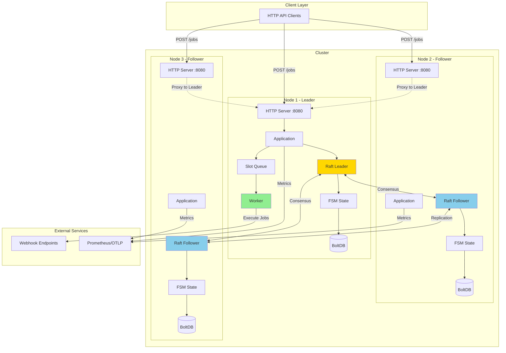
```mermaid
graph TB
    subgraph "Client Layer"
        API[HTTP API Clients]
    end
    
    subgraph "Cluster"
        subgraph "Node 1 - Leader"
            HTTP1[HTTP Server :8080]
            APP1[Application]
            WORKER1[Worker]
            QUEUE1[Slot Queue]
            FSM1[FSM State]
            RAFT1[Raft Leader]
            STORE1[(BoltDB)]
        end
        
        subgraph "Node 2 - Follower"
            HTTP2[HTTP Server :8080]
            APP2[Application]
            RAFT2[Raft Follower]
            FSM2[FSM State]
            STORE2[(BoltDB)]
        end
        
        subgraph "Node 3 - Follower"
            HTTP3[HTTP Server :8080]
            APP3[Application]
            RAFT3[Raft Follower]
            FSM3[FSM State]
            STORE3[(BoltDB)]
        end
    end
    
    subgraph "External Services"
        WEBHOOK[Webhook Endpoints]
        METRICS[Prometheus/OTLP]
    end
    
    API -->|POST /jobs| HTTP1
    API -->|POST /jobs| HTTP2
    API -->|POST /jobs| HTTP3
    
    HTTP2 -.->|Proxy to Leader| HTTP1
    HTTP3 -.->|Proxy to Leader| HTTP1
    
    HTTP1 --> APP1
    APP1 --> RAFT1
    RAFT1 --> FSM1
    FSM1 --> STORE1
    
    APP1 --> QUEUE1
    QUEUE1 --> WORKER1
    WORKER1 -->|Execute Jobs| WEBHOOK
    
    RAFT1 <-->|Consensus| RAFT2
    RAFT1 <-->|Consensus| RAFT3
    RAFT2 <-->|Replication| RAFT3
    
    RAFT2 --> FSM2
    RAFT3 --> FSM3
    FSM2 --> STORE2
    FSM3 --> STORE3
    
    APP1 -->|Metrics| METRICS
    APP2 -->|Metrics| METRICS
    APP3 -->|Metrics| METRICS
    
    style WORKER1 fill:#90EE90
    style RAFT1 fill:#FFD700
    style RAFT2 fill:#87CEEB
    style RAFT3 fill:#87CEEB
```

## Core Components

### 1. HTTP API Layer

**Location:** `internal/api/`

Handles incoming HTTP requests and provides REST endpoints:

**Job Management:**
- `POST /jobs` - Create new job
- `GET /jobs/{id}` - Retrieve job details
- `DELETE /jobs/{id}` - Delete job

**Status Tracking:**
- `GET /jobs/{id}/status` - Get job execution status
- `GET /jobs/{id}/executions` - Get execution history
- `GET /jobs?status={status}` - List jobs by status
- `POST /jobs/{id}/cancel` - Cancel job

**Health & Cluster:**
- `GET /health` - Health check with status metrics
- `POST /join` - Join cluster
- `GET /debug/cluster` - Cluster information

**Key Features:**
- Automatic proxy to leader for write operations
- CORS support
- Request validation
- Metrics instrumentation
- Status queries work on followers (read from local FSM)

### 2. Raft Consensus Layer

**Location:** `internal/store/`

Implements distributed consensus using HashiCorp Raft:

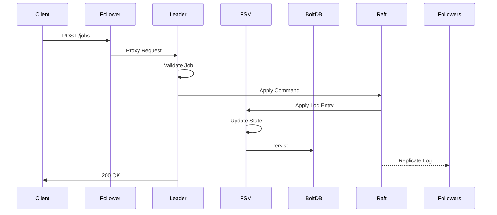
```mermaid
sequenceDiagram
    participant Client
    participant Follower
    participant Leader
    participant FSM
    participant BoltDB
    
    Client->>Follower: POST /jobs
    Follower->>Leader: Proxy Request
    Leader->>Leader: Validate Job
    Leader->>Raft: Apply Command
    Raft->>FSM: Apply Log Entry
    FSM->>FSM: Update State
    FSM->>BoltDB: Persist
    Raft-->>Followers: Replicate Log
    Leader->>Client: 200 OK
```

**Components:**
- **Store**: Raft wrapper and cluster management
- **FSM (Finite State Machine)**: State transitions for jobs and slots
- **Transport**: Network communication between nodes
- **Snapshot**: State persistence and recovery

### 3. Job Scheduling Layer

**Location:** `internal/slots/`

Organizes jobs into time-based slots for efficient execution:

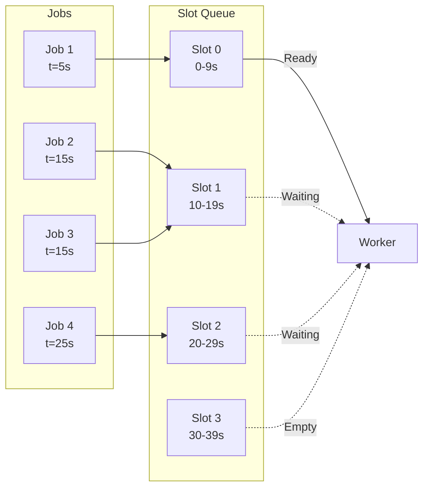
```mermaid
graph LR
    subgraph "Slot Queue"
        S0[Slot 0<br/>0-9s]
        S1[Slot 1<br/>10-19s]
        S2[Slot 2<br/>20-29s]
        S3[Slot 3<br/>30-39s]
    end
    
    subgraph "Jobs"
        J1[Job 1<br/>t=5s]
        J2[Job 2<br/>t=15s]
        J3[Job 3<br/>t=15s]
        J4[Job 4<br/>t=25s]
    end
    
    J1 --> S0
    J2 --> S1
    J3 --> S1
    J4 --> S2
    
    S0 -->|Ready| WORKER[Worker]
    S1 -.->|Waiting| WORKER
    S2 -.->|Waiting| WORKER
    S3 -.->|Empty| WORKER
```

**Components:**
- **SlotQueue**: Min-heap based priority queue
- **PersistentSlotQueue**: Raft-backed slot persistence
- **Worker**: Job execution engine (leader-only)

### 4. Status Tracking Layer

**Location:** `internal/store/status_tracker.go`, `internal/slots/execution_manager.go`

Manages job execution state and provides idempotency guarantees:

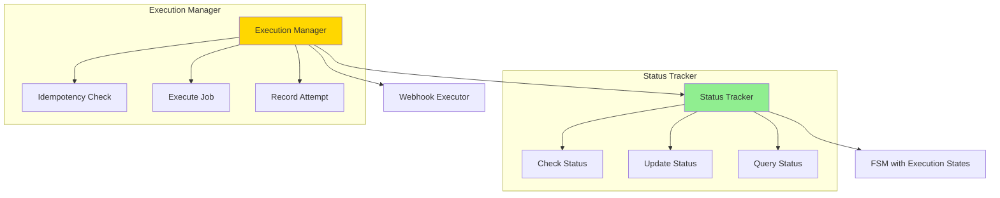
```mermaid
graph TB
    EM[Execution Manager] --> ST[Status Tracker]
    ST --> FSM[FSM with Execution States]
    EM --> WH[Webhook Executor]
    
    subgraph "Status Tracker"
        ST --> CHECK[Check Status]
        ST --> UPDATE[Update Status]
        ST --> QUERY[Query Status]
    end
    
    subgraph "Execution Manager"
        EM --> IDEMPOTENCY[Idempotency Check]
        EM --> EXECUTE[Execute Job]
        EM --> RECORD[Record Attempt]
    end
    
    style ST fill:#90EE90
    style EM fill:#FFD700
```

**Components:**

**StatusTracker:**
- Manages job execution states (pending, in_progress, completed, failed, cancelled, timeout)
- Provides idempotency checks to prevent duplicate execution
- Records execution attempts with detailed information
- Handles timeout detection and re-execution
- Supports status queries and filtering

**ExecutionManager:**
- Coordinates job execution with status tracking
- Checks idempotency before execution
- Marks jobs as in_progress before webhook call
- Records execution attempts with timing and error details
- Classifies errors (timeout, connection_error, dns_error, http_error)
- Updates final status (completed/failed) after execution

**Key Features:**
- Prevents duplicate execution during leader failover
- Maintains detailed execution history
- Supports configurable timeouts and retry limits
- Provides execution metrics for monitoring
- Enables job cancellation (pending and in-progress)

### 5. Capacity Management Layer

**Location:** `internal/slots/`

Enforces memory-based and count-based limits to prevent system overload:

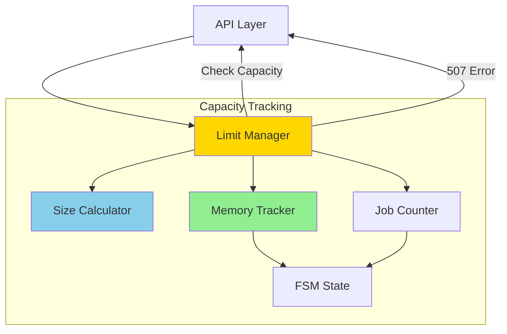
```mermaid
graph TB
    API[API Layer] --> LM[Limit Manager]
    
    subgraph "Capacity Tracking"
        LM --> SC[Size Calculator]
        LM --> MT[Memory Tracker]
        LM --> JC[Job Counter]
        
        MT --> FSM[FSM State]
        JC --> FSM
    end
    
    LM -->|Check Capacity| API
    LM -->|507 Error| API
    
    style LM fill:#FFD700
    style MT fill:#90EE90
    style SC fill:#87CEEB
```

**Components:**

**Size Calculator:**
- Calculates job memory footprint
- Includes payload serialization size
- Accounts for string fields and metadata
- Performance: < 1ms per calculation

**Memory Tracker:**
- Tracks total memory usage via Raft
- Enforces configurable memory limits
- Provides utilization metrics
- Auto-detects system memory

**Job Counter:**
- Tracks total job count via Raft
- Enforces configurable count limits
- Prevents unbounded growth

**Limit Manager:**
- Coordinates capacity checks
- Rejects jobs when limits exceeded
- Returns 507 HTTP status code
- Updates metrics on rejections

### 6. Service Discovery

**Location:** `internal/discovery/`

Multiple strategies for cluster formation:

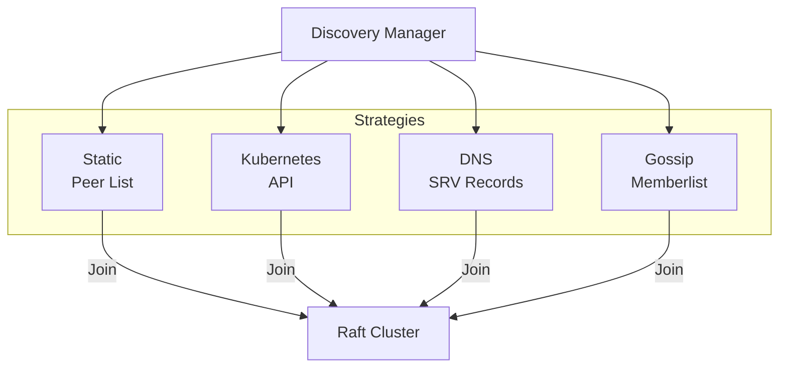
```mermaid
graph TB
    DM[Discovery Manager]
    
    subgraph "Strategies"
        STATIC[Static<br/>Peer List]
        K8S[Kubernetes<br/>API]
        DNS[DNS<br/>SRV Records]
        GOSSIP[Gossip<br/>Memberlist]
    end
    
    DM --> STATIC
    DM --> K8S
    DM --> DNS
    DM --> GOSSIP
    
    STATIC -->|Join| RAFT[Raft Cluster]
    K8S -->|Join| RAFT
    DNS -->|Join| RAFT
    GOSSIP -->|Join| RAFT
```

## Data Flow

### Job Creation Flow with Capacity Checks

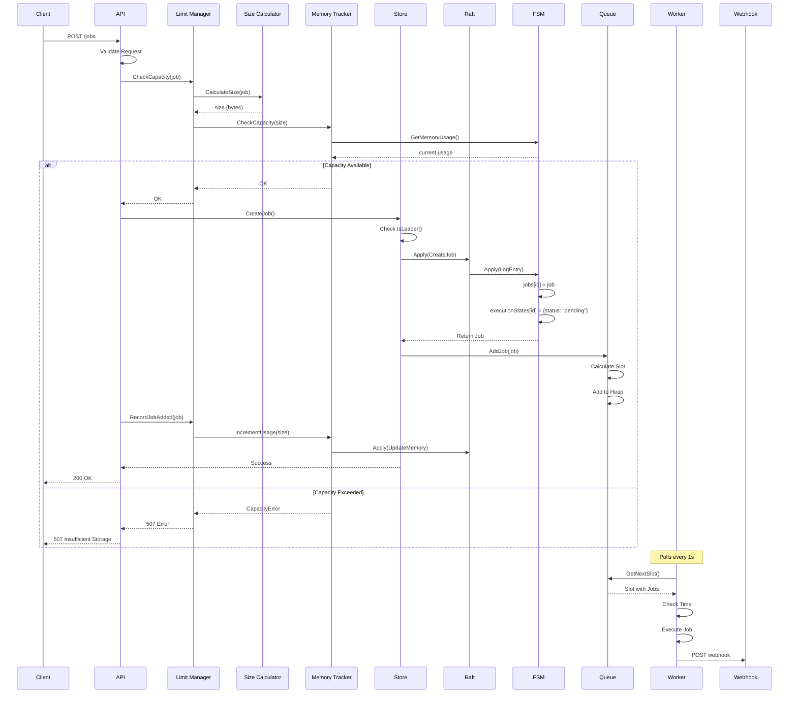
```mermaid
sequenceDiagram
    participant Client
    participant API
    participant LM as Limit Manager
    participant SC as Size Calculator
    participant MT as Memory Tracker
    participant Store
    participant Raft
    participant FSM
    participant Queue
    participant Worker
    
    Client->>API: POST /jobs
    API->>API: Validate Request
    API->>LM: CheckCapacity(job)
    LM->>SC: CalculateSize(job)
    SC-->>LM: size (bytes)
    LM->>MT: CheckCapacity(size)
    MT->>FSM: GetMemoryUsage()
    FSM-->>MT: current usage
    
    alt Capacity Available
        MT-->>LM: OK
        LM-->>API: OK
        API->>Store: CreateJob()
        Store->>Store: Check IsLeader()
        Store->>Raft: Apply(CreateJob)
        Raft->>FSM: Apply(LogEntry)
        FSM->>FSM: jobs[id] = job
        FSM->>FSM: executionStates[id] = {status: "pending"}
        FSM-->>Store: Return Job
        Store->>Queue: AddJob(job)
        Queue->>Queue: Calculate Slot
        Queue->>Queue: Add to Heap
        API->>LM: RecordJobAdded(job)
        LM->>MT: IncrementUsage(size)
        MT->>Raft: Apply(UpdateMemory)
        Store-->>API: Success
        API-->>Client: 200 OK
    else Capacity Exceeded
        MT-->>LM: CapacityError
        LM-->>API: 507 Error
        API-->>Client: 507 Insufficient Storage
    end
    
    Note over Worker: Polls every 1s
    Worker->>Queue: GetNextSlot()
    Queue-->>Worker: Slot with Jobs
    Worker->>Worker: Check Time
    Worker->>Worker: Execute Job
    Worker->>Webhook: POST webhook
```

### Job Execution Flow with Status Tracking

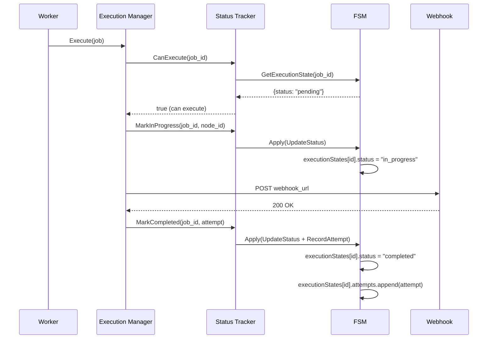
```mermaid
sequenceDiagram
    participant Worker
    participant EM as Execution Manager
    participant ST as Status Tracker
    participant FSM
    participant Webhook
    
    Worker->>EM: Execute(job)
    EM->>ST: CanExecute(job_id)
    ST->>FSM: GetExecutionState(job_id)
    FSM-->>ST: {status: "pending"}
    ST-->>EM: true (can execute)
    
    EM->>ST: MarkInProgress(job_id, node_id)
    ST->>FSM: Apply(UpdateStatus)
    FSM->>FSM: executionStates[id].status = "in_progress"
    
    EM->>Webhook: POST webhook_url
    Webhook-->>EM: 200 OK
    
    EM->>ST: MarkCompleted(job_id, attempt)
    ST->>FSM: Apply(UpdateStatus + RecordAttempt)
    FSM->>FSM: executionStates[id].status = "completed"
    FSM->>FSM: executionStates[id].attempts.append(attempt)
```

### Job Status State Machine

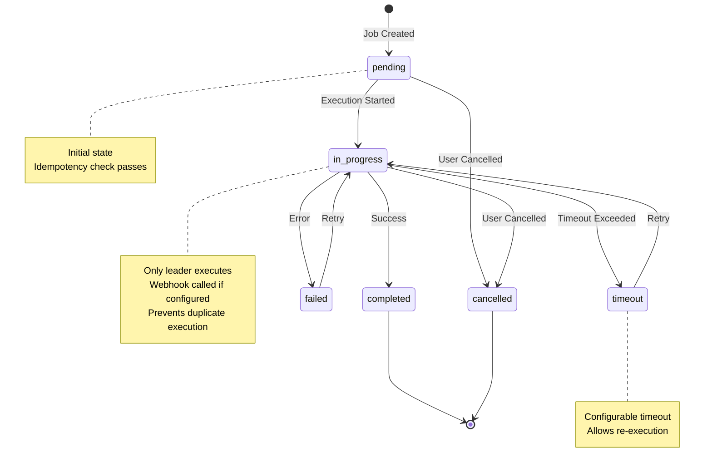
```mermaid
stateDiagram-v2
    [*] --> pending: Job Created
    pending --> in_progress: Execution Started
    pending --> cancelled: User Cancelled
    
    in_progress --> completed: Success
    in_progress --> failed: Error
    in_progress --> timeout: Timeout Exceeded
    in_progress --> cancelled: User Cancelled
    
    timeout --> in_progress: Retry
    failed --> in_progress: Retry
    
    completed --> [*]
    cancelled --> [*]
    
    note right of pending
        Initial state
        Idempotency check passes
    end note
    
    note right of in_progress
        Only leader executes
        Webhook called if configured
        Prevents duplicate execution
    end note
    
    note right of timeout
        Configurable timeout
        Allows re-execution
    end note
```

### Recurring Job Flow

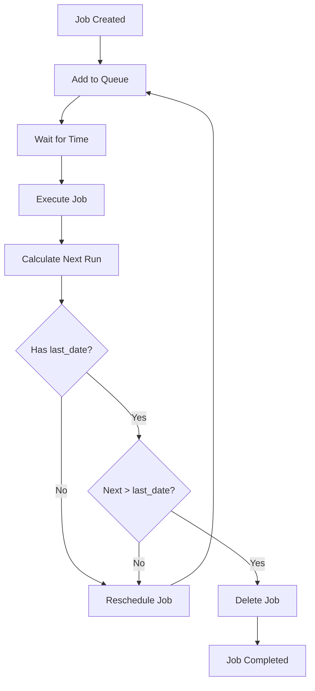
```mermaid
graph TD
    START[Job Created] --> QUEUE[Add to Queue]
    QUEUE --> WAIT[Wait for Time]
    WAIT --> EXEC[Execute Job]
    EXEC --> CALC[Calculate Next Run]
    CALC --> CHECK{Has last_date?}
    CHECK -->|No| RESCHEDULE[Reschedule Job]
    CHECK -->|Yes| COMPARE{Next > last_date?}
    COMPARE -->|No| RESCHEDULE
    COMPARE -->|Yes| DELETE[Delete Job]
    RESCHEDULE --> QUEUE
    DELETE --> END[Job Completed]
```

## State Management

### FSM State Structure

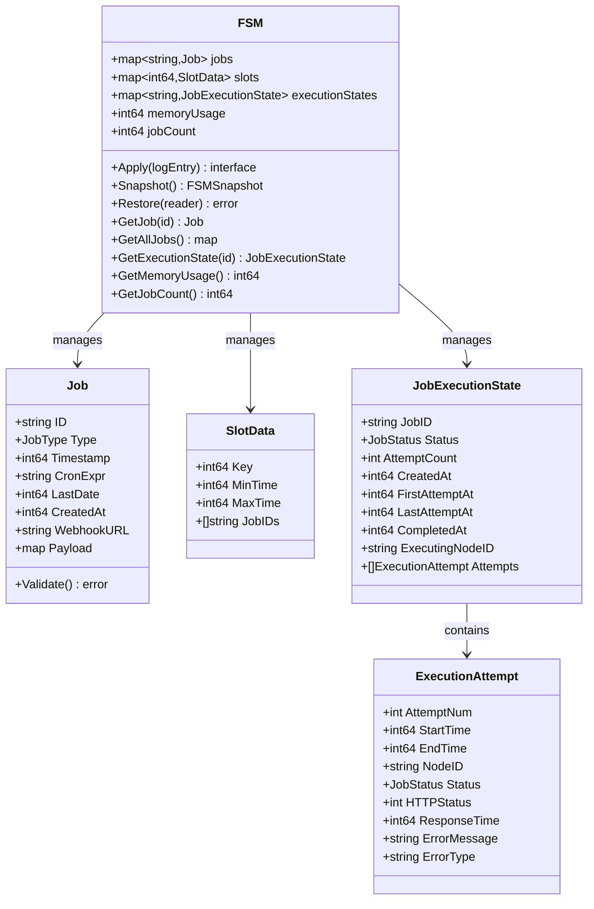
```mermaid
classDiagram
    class FSM {
        +map~string,Job~ jobs
        +map~int64,SlotData~ slots
        +map~string,JobExecutionState~ executionStates
        +int64 memoryUsage
        +int64 jobCount
        +Apply(logEntry) interface
        +Snapshot() FSMSnapshot
        +Restore(reader) error
        +GetJob(id) Job
        +GetAllJobs() map
        +GetExecutionState(id) JobExecutionState
        +GetMemoryUsage() int64
        +GetJobCount() int64
    }
    
    class Job {
        +string ID
        +JobType Type
        +int64 Timestamp
        +string CronExpr
        +int64 LastDate
        +int64 CreatedAt
        +string WebhookURL
        +map Payload
        +Validate() error
    }
    
    class SlotData {
        +int64 Key
        +int64 MinTime
        +int64 MaxTime
        +[]string JobIDs
    }
    
    class JobExecutionState {
        +string JobID
        +JobStatus Status
        +int AttemptCount
        +int64 CreatedAt
        +int64 FirstAttemptAt
        +int64 LastAttemptAt
        +int64 CompletedAt
        +string ExecutingNodeID
        +[]ExecutionAttempt Attempts
    }
    
    class ExecutionAttempt {
        +int AttemptNum
        +int64 StartTime
        +int64 EndTime
        +string NodeID
        +JobStatus Status
        +int HTTPStatus
        +int64 ResponseTime
        +string ErrorMessage
        +string ErrorType
    }
    
    FSM --> Job: manages
    FSM --> SlotData: manages
    FSM --> JobExecutionState: manages
    JobExecutionState --> ExecutionAttempt: contains
```

### Snapshot Format

```json
{
  "jobs": {
    "job-id-1": {
      "id": "job-id-1",
      "type": "unico",
      "timestamp": 1704067200,
      "created_at": 1704060000,
      "webhook_url": "https://example.com/webhook"
    }
  },
  "slots": {
    "100": {
      "key": 100,
      "min_time": 1000,
      "max_time": 1099,
      "job_ids": ["job-id-1", "job-id-2"]
    }
  },
  "execution_states": {
    "job-id-1": {
      "job_id": "job-id-1",
      "status": "completed",
      "attempt_count": 1,
      "created_at": 1704060000,
      "first_attempt_at": 1704067200,
      "last_attempt_at": 1704067200,
      "completed_at": 1704067201,
      "executing_node_id": "node-1",
      "attempts": [
        {
          "attempt_num": 1,
          "start_time": 1704067200,
          "end_time": 1704067201,
          "node_id": "node-1",
          "status": "completed",
          "http_status": 200,
          "response_time_ms": 234
        }
      ]
    }
  },
  "memory_usage": 1024000,
  "job_count": 42
}
```

## Leadership and Failover

### Leader Election

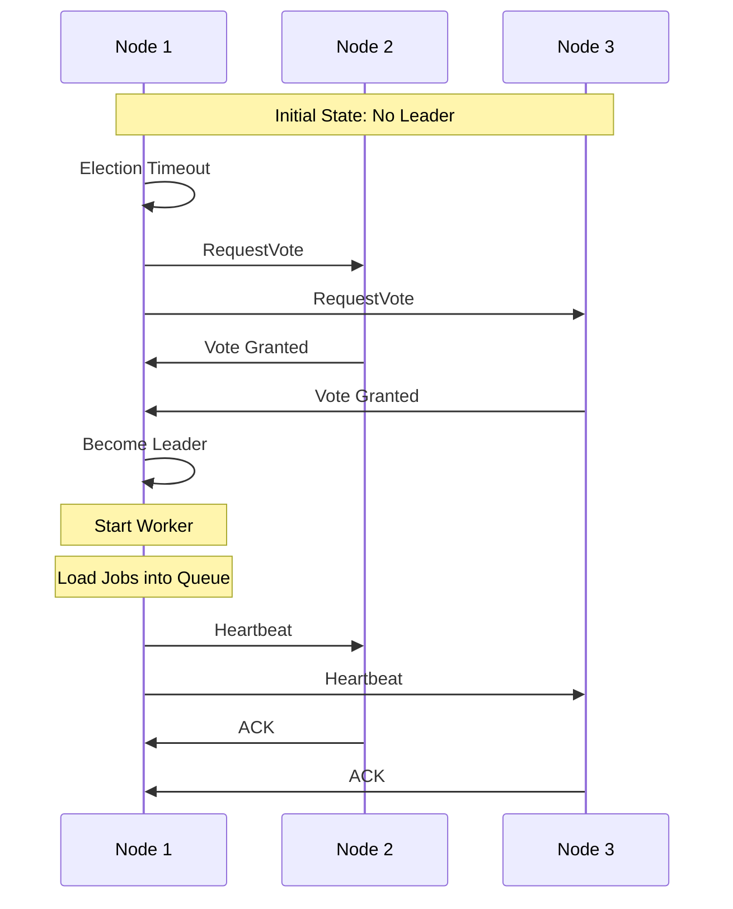
```mermaid
sequenceDiagram
    participant N1 as Node 1
    participant N2 as Node 2
    participant N3 as Node 3
    
    Note over N1,N3: Initial State: No Leader
    
    N1->>N1: Election Timeout
    N1->>N2: RequestVote
    N1->>N3: RequestVote
    N2->>N1: Vote Granted
    N3->>N1: Vote Granted
    N1->>N1: Become Leader
    
    Note over N1: Start Worker
    Note over N1: Load Jobs into Queue
    
    N1->>N2: Heartbeat
    N1->>N3: Heartbeat
    N2->>N1: ACK
    N3->>N1: ACK
```

### Graceful Leader Resignation

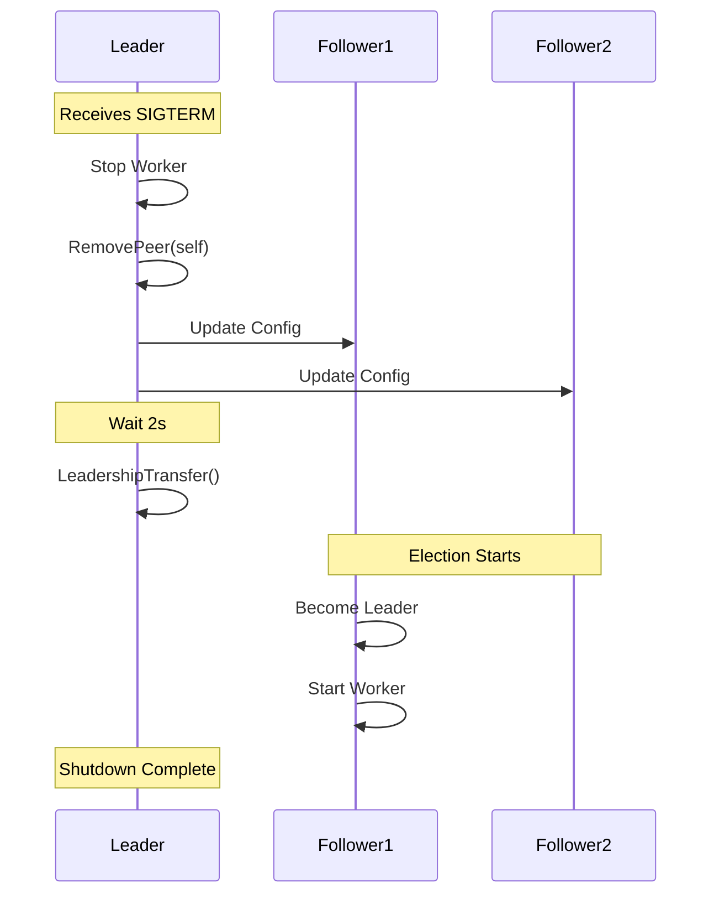
```mermaid
sequenceDiagram
    participant Leader
    participant Follower1
    participant Follower2
    
    Note over Leader: Receives SIGTERM
    
    Leader->>Leader: Stop Worker
    Leader->>Leader: RemovePeer(self)
    Leader->>Follower1: Update Config
    Leader->>Follower2: Update Config
    
    Note over Leader: Wait 2s
    
    Leader->>Leader: LeadershipTransfer()
    
    Note over Follower1,Follower2: Election Starts
    
    Follower1->>Follower1: Become Leader
    Follower1->>Follower1: Start Worker
    
    Note over Leader: Shutdown Complete
```

## Deployment Architectures

### Docker Compose (Development)

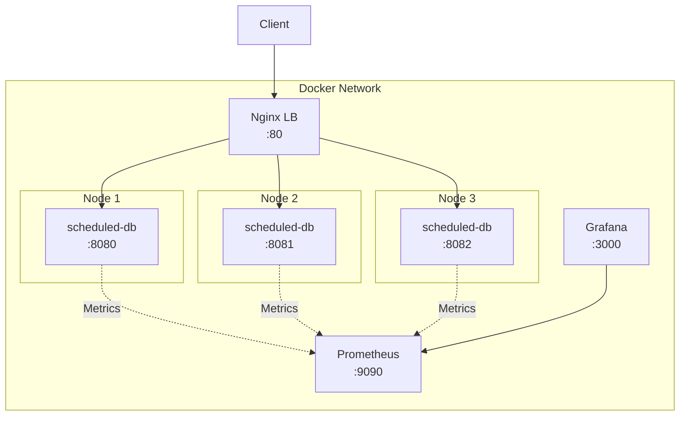
```mermaid
graph TB
    subgraph "Docker Network"
        NGINX[Nginx LB<br/>:80]
        
        subgraph "Node 1"
            N1[scheduled-db<br/>:8080]
        end
        
        subgraph "Node 2"
            N2[scheduled-db<br/>:8081]
        end
        
        subgraph "Node 3"
            N3[scheduled-db<br/>:8082]
        end
        
        PROM[Prometheus<br/>:9090]
        GRAF[Grafana<br/>:3000]
    end
    
    CLIENT[Client] --> NGINX
    NGINX --> N1
    NGINX --> N2
    NGINX --> N3
    
    N1 -.->|Metrics| PROM
    N2 -.->|Metrics| PROM
    N3 -.->|Metrics| PROM
    
    GRAF --> PROM
```

### Kubernetes (Production)

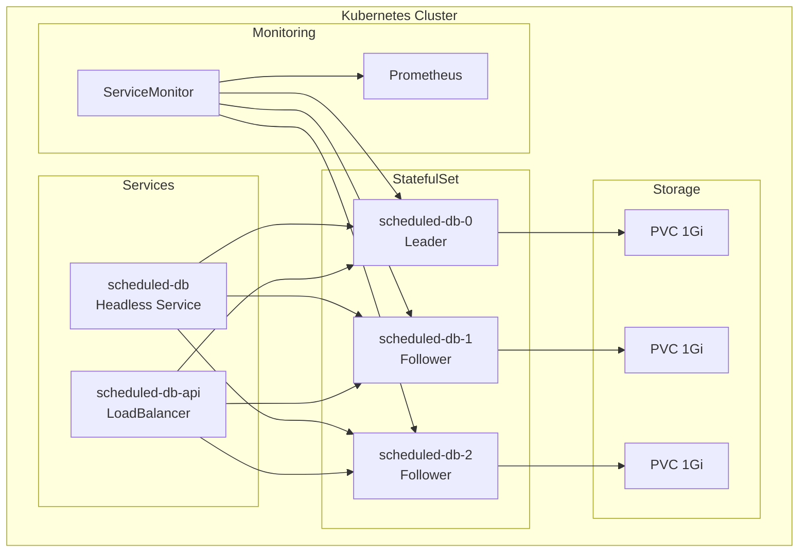
```mermaid
graph TB
    subgraph "Kubernetes Cluster"
        subgraph "StatefulSet"
            POD0[scheduled-db-0<br/>Leader]
            POD1[scheduled-db-1<br/>Follower]
            POD2[scheduled-db-2<br/>Follower]
        end
        
        subgraph "Services"
            HEADLESS[scheduled-db<br/>Headless Service]
            API[scheduled-db-api<br/>LoadBalancer]
        end
        
        subgraph "Storage"
            PVC0[PVC 1Gi]
            PVC1[PVC 1Gi]
            PVC2[PVC 1Gi]
        end
        
        subgraph "Monitoring"
            SM[ServiceMonitor]
            PROM[Prometheus]
        end
    end
    
    POD0 --> PVC0
    POD1 --> PVC1
    POD2 --> PVC2
    
    HEADLESS --> POD0
    HEADLESS --> POD1
    HEADLESS --> POD2
    
    API --> POD0
    API --> POD1
    API --> POD2
    
    SM --> POD0
    SM --> POD1
    SM --> POD2
    SM --> PROM
```

## Performance Characteristics

### Slot-Based Scheduling

- **Slot Gap**: Configurable (default 10s)
- **Slot Calculation**: `slot_key = timestamp / slot_gap`
- **Lookup Complexity**: O(log n) using min-heap
- **Memory**: O(jobs + slots)

### Raft Performance

- **Write Latency**: ~5-10ms (local network)
- **Replication**: Majority quorum (2/3 nodes)
- **Snapshot Frequency**: Configurable
- **Log Compaction**: Automatic

### Scalability

- **Horizontal**: Add more follower nodes
- **Vertical**: Increase resources per node
- **Job Throughput**: ~1000 jobs/sec (single leader)
- **Cluster Size**: Recommended 3-7 nodes

## Security Considerations

### Network Security

- TLS for Raft communication (configurable)
- RBAC for Kubernetes deployments
- Network policies for pod isolation

### Data Security

- Encrypted snapshots (optional)
- Webhook authentication (bearer tokens)
- Audit logging for job operations

### High Availability

- Minimum 3 nodes for quorum
- PodDisruptionBudget in Kubernetes
- Graceful leader resignation
- Split-brain prevention

## Monitoring and Observability

### Metrics Exposed

**Job Metrics:**
- Job creation/deletion rates
- Job execution success/failure
- Jobs by status (pending, in_progress, completed, failed, cancelled, timeout)
- Execution duration histogram
- Execution failures by error type
- Retry count histogram

**Capacity Metrics:**
- Queue memory usage (bytes)
- Queue memory limit (bytes)
- Memory utilization percentage
- Job count
- Job count limit
- Job rejections by reason (memory/job_count)

**Status Tracking Metrics:**
- Status query latency
- Execution attempt counts
- Timeout detection rate
- Cancellation rate

**Cluster Metrics:**
- Raft cluster health
- Leader election events
- Slot queue size
- Worker processing time

### Health Endpoints

- `/health` - Node health and role
- `/debug/cluster` - Cluster configuration
- `/metrics` - Prometheus metrics (port 9090)

### Logging Levels

- **DEBUG**: Internal operations, state changes
- **INFO**: Important events, job lifecycle
- **WARN**: Potential issues, degraded performance
- **ERROR**: Failures, critical errors

## Status Tracking Architecture

### Overview

The status tracking system provides comprehensive execution state management with idempotency guarantees. It prevents duplicate execution during leader failover and maintains detailed execution history.

### Components

**StatusTracker** (`internal/store/status_tracker.go`):
- Wraps the Raft Store for status operations
- Manages execution states through Raft consensus
- Provides idempotency checks
- Handles timeout detection
- Supports status queries and filtering

**ExecutionManager** (`internal/slots/execution_manager.go`):
- Coordinates job execution with status tracking
- Enforces idempotency before execution
- Records detailed execution attempts
- Classifies errors for metrics
- Handles job cancellation

### Status Lifecycle

1. **Job Creation**: Status initialized to "pending"
2. **Execution Start**: Status updated to "in_progress" via Raft
3. **Webhook Call**: Executed with timeout context
4. **Execution Complete**: Status updated to "completed" or "failed"
5. **Timeout Handling**: Jobs exceeding timeout marked as "timeout"
6. **Retry Logic**: Timed-out or failed jobs can be retried
7. **Cancellation**: Jobs can be cancelled at any stage

### Idempotency Guarantees

The system prevents duplicate execution through:

1. **Status Check**: Before execution, check if job already completed
2. **Atomic Updates**: Status changes applied through Raft consensus
3. **Leader-Only Execution**: Only leader executes jobs
4. **Failover Protection**: New leader checks status before re-execution

### Execution History

Each execution attempt records:
- Attempt number
- Start and end timestamps
- Executing node ID
- HTTP status code
- Response time
- Error message and type

History is stored in FSM and replicated across cluster.

### Configuration

**Environment Variables:**
- `JOB_EXECUTION_TIMEOUT`: Webhook execution timeout (default: 5m)
- `JOB_INPROGRESS_TIMEOUT`: In-progress job timeout (default: 5m)
- `MAX_EXECUTION_ATTEMPTS`: Maximum retry attempts (default: 3)
- `EXECUTION_HISTORY_RETENTION`: History retention period (default: 30d)
- `HEALTH_FAILURE_THRESHOLD`: Health check failure ratio (default: 0.1)

### Performance Considerations

**Memory Usage:**
- Execution states stored in FSM memory
- Estimated ~500 bytes per job (with 3 attempts)
- For 1M jobs: ~500MB memory overhead
- Mitigated by retention policy

**Raft Log Growth:**
- Each status update creates a log entry
- Estimated 3-5 updates per job
- Regular snapshots compact log

**Query Performance:**
- Status queries: O(1) map lookup
- Status filtering: O(n) with secondary indexes
- Execution history: O(1) lookup + O(k) attempts

## Capacity Management Architecture

### Overview

The capacity management system prevents system overload by enforcing memory-based and count-based limits on the job queue. It provides accurate job size calculation, Raft-consistent tracking, and clear error responses when limits are exceeded.

### Components

**Size Calculator** (`internal/slots/size_calculator.go`):
- Calculates job memory footprint
- Includes all string fields (ID, webhook URL, cron expression)
- Serializes payload to JSON for accurate size
- Adds fixed overhead for metadata
- Performance target: < 1ms per calculation

**Memory Tracker** (`internal/slots/memory_tracker.go`):
- Tracks total memory usage via Raft consensus
- Enforces configurable memory limits
- Provides current usage, limit, available, and utilization
- Supports auto-detection of system memory
- Updates are replicated across cluster

**Job Counter** (`internal/slots/job_counter.go`):
- Tracks total job count via Raft consensus
- Enforces configurable count limits
- Prevents unbounded job growth
- Simple increment/decrement operations

**Limit Manager** (`internal/slots/limit_manager.go`):
- Coordinates all capacity checks
- Checks both memory and count limits
- Records job additions/removals
- Returns structured capacity errors
- Updates Prometheus metrics

### Capacity Check Flow

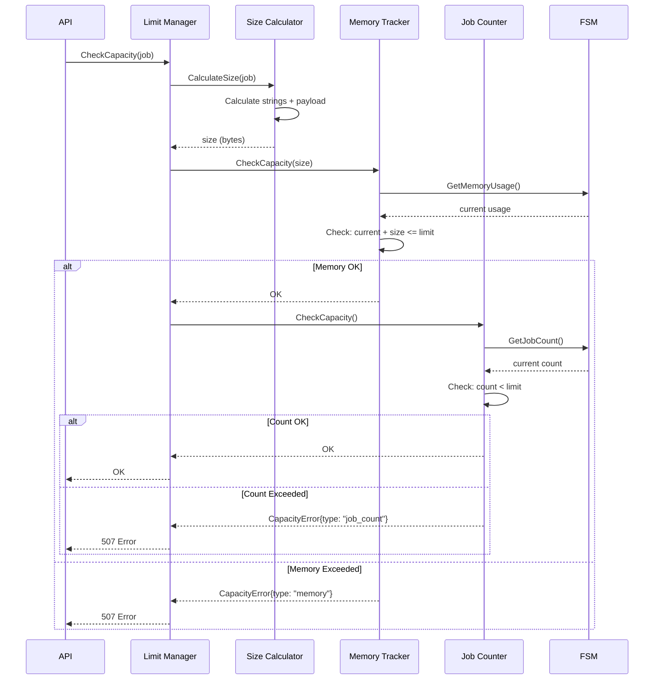
```mermaid
sequenceDiagram
    participant API
    participant LM as Limit Manager
    participant SC as Size Calculator
    participant MT as Memory Tracker
    participant JC as Job Counter
    participant FSM
    
    API->>LM: CheckCapacity(job)
    
    LM->>SC: CalculateSize(job)
    SC->>SC: Calculate strings + payload
    SC-->>LM: size (bytes)
    
    LM->>MT: CheckCapacity(size)
    MT->>FSM: GetMemoryUsage()
    FSM-->>MT: current usage
    MT->>MT: Check: current + size <= limit
    
    alt Memory OK
        MT-->>LM: OK
        LM->>JC: CheckCapacity()
        JC->>FSM: GetJobCount()
        FSM-->>JC: current count
        JC->>JC: Check: count < limit
        
        alt Count OK
            JC-->>LM: OK
            LM-->>API: OK
        else Count Exceeded
            JC-->>LM: CapacityError{type: "job_count"}
            LM-->>API: 507 Error
        end
    else Memory Exceeded
        MT-->>LM: CapacityError{type: "memory"}
        LM-->>API: 507 Error
    end
```

### Configuration

**Environment Variables:**

```bash
# Explicit memory limit (takes precedence)
QUEUE_MEMORY_LIMIT=2GB

# Memory percentage (used if QUEUE_MEMORY_LIMIT not set)
QUEUE_MEMORY_PERCENT=50

# Job count limit
QUEUE_JOB_LIMIT=100000
```

**Memory Limit Detection:**

1. If `QUEUE_MEMORY_LIMIT` is set, use that value
2. Otherwise, detect system memory using `runtime.MemStats`
3. Calculate limit as `system_memory * (QUEUE_MEMORY_PERCENT / 100)`
4. Default percentage is 50%

**Supported Formats:**
- `2GB` - 2 gigabytes
- `500MB` - 500 megabytes
- `1024KB` - 1024 kilobytes
- `1073741824` - Bytes (no suffix)

### Job Size Calculation

**Components included in size:**

1. **Fixed overhead**: ~64 bytes for metadata
2. **Job ID**: String length in bytes
3. **Webhook URL**: String length in bytes (if present)
4. **Cron expression**: String length in bytes (if present)
5. **Payload**: JSON serialization size (if present)

**Example sizes:**
- Minimal job (no payload): ~200 bytes
- Job with 1KB payload: ~1.2KB
- Job with 10KB payload: ~10.2KB
- Job with 100KB payload: ~100.2KB

### Memory Tracking

**Raft Integration:**

All memory updates go through Raft consensus:

```go
// When job is added
Command{
    Type: CommandUpdateMemoryUsage,
    Data: MemoryUpdate{Delta: +jobSize}
}

// When job is deleted
Command{
    Type: CommandUpdateMemoryUsage,
    Data: MemoryUpdate{Delta: -jobSize}
}
```

**FSM State:**

```go
type FSM struct {
    // ... existing fields
    memoryUsage int64  // Total memory used by jobs
    jobCount    int64  // Total number of jobs
}
```

**Snapshot/Restore:**

Memory usage and job count are included in snapshots for recovery after restart.

### Error Responses

**Memory Limit Exceeded:**

```json
{
  "error": "insufficient memory: current=950000000 bytes, limit=1000000000 bytes, requested=100000000 bytes",
  "type": "memory",
  "current": 950000000,
  "limit": 1000000000,
  "requested": 100000000
}
```

**Job Count Limit Exceeded:**

```json
{
  "error": "maximum jobs reached: current=100000, limit=100000",
  "type": "job_count",
  "current": 100000,
  "limit": 100000
}
```

### Metrics

**Prometheus Metrics:**

```
# Memory usage in bytes
scheduled_db_queue_memory_usage_bytes

# Configured memory limit in bytes
scheduled_db_queue_memory_limit_bytes

# Memory utilization percentage (0-100)
scheduled_db_queue_memory_utilization_percent

# Current job count
scheduled_db_queue_job_count

# Configured job count limit
scheduled_db_queue_job_limit

# Job rejections counter with reason label
scheduled_db_job_rejections_total{reason="memory"}
scheduled_db_job_rejections_total{reason="job_count"}
```

### Health Endpoint Integration

The `/health` endpoint includes capacity information:

```json
{
  "status": "degraded",
  "memory": {
    "current_bytes": 920000000,
    "limit_bytes": 1000000000,
    "available_bytes": 80000000,
    "utilization_percent": 92.0
  },
  "jobs": {
    "current_count": 95000,
    "limit": 100000,
    "available": 5000
  }
}
```

**Health Status:**
- `healthy`: Utilization < 90%
- `degraded`: Utilization >= 90%
- `unhealthy`: Critical failures

### Performance Considerations

**Memory Overhead:**
- Size Calculator: ~100 bytes per calculation (temporary)
- Memory Tracker: ~24 bytes (int64 + overhead)
- Job Counter: ~24 bytes (int64 + overhead)
- Total per job operation: < 200 bytes

**Calculation Performance:**
- Job size calculation: O(1) for fixed fields + O(n) for payload
- Memory check: O(1) map lookup
- Count check: O(1) integer comparison
- Target: < 1ms per operation

**Raft Impact:**
- Memory updates: 1 Raft log entry per job add/remove
- Minimal impact: updates piggyback on existing job operations
- No additional network round trips

### Capacity Management Best Practices

1. **Set appropriate limits** based on available system memory
2. **Monitor utilization** using Prometheus metrics
3. **Set up alerts** when utilization exceeds 80%
4. **Clean up completed jobs** regularly
5. **Use job count limits** to prevent unbounded growth
6. **Test capacity** under expected load before production
7. **Scale horizontally** when approaching limits

### Troubleshooting

**High memory utilization:**
- Check current usage: `curl /health | jq '.memory'`
- List jobs by status: `curl /jobs?status=completed`
- Delete old completed jobs
- Increase memory limit if appropriate
- Consider horizontal scaling

**Frequent rejections:**
- Monitor rejection rate: `curl /metrics | grep job_rejections_total`
- Analyze job sizes: Check payload sizes
- Adjust limits based on actual usage patterns
- Implement job prioritization if needed

**Memory tracking inconsistencies:**
- Verify Raft cluster health
- Check for split-brain conditions
- Restart nodes if necessary
- Verify snapshot/restore working correctly

## References

- [Raft Consensus Algorithm](https://raft.github.io/)
- [HashiCorp Raft Implementation](https://github.com/hashicorp/raft)
- [Kubernetes StatefulSets](https://kubernetes.io/docs/concepts/workloads/controllers/statefulset/)
