# Scheduled-DB Architecture

## Overview

Scheduled-DB is a distributed job scheduling system built on Raft consensus. It provides reliable, fault-tolerant job execution across a cluster of nodes with automatic leader election and failover.

## High-Level Architecture

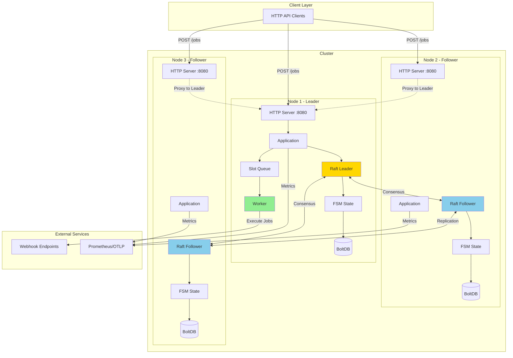

## Core Components

### 1. HTTP API Layer

**Location:** `internal/api/`

Handles incoming HTTP requests and provides REST endpoints:

- `POST /jobs` - Create new job
- `GET /jobs/{id}` - Retrieve job details
- `DELETE /jobs/{id}` - Delete job
- `GET /health` - Health check
- `POST /join` - Join cluster
- `GET /debug/cluster` - Cluster information

**Key Features:**
- Automatic proxy to leader for write operations
- CORS support
- Request validation
- Metrics instrumentation

### 2. Raft Consensus Layer

**Location:** `internal/store/`

Implements distributed consensus using HashiCorp Raft:

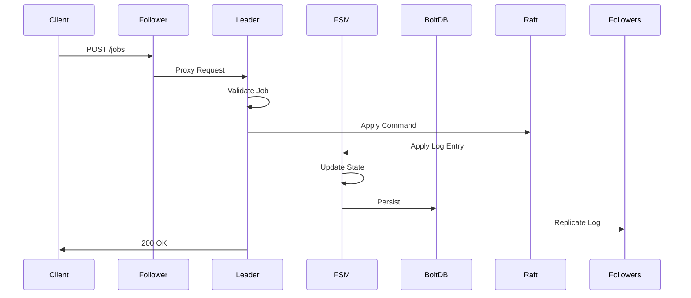

**Components:**
- **Store**: Raft wrapper and cluster management
- **FSM (Finite State Machine)**: State transitions for jobs and slots
- **Transport**: Network communication between nodes
- **Snapshot**: State persistence and recovery

### 3. Job Scheduling Layer

**Location:** `internal/slots/`

Organizes jobs into time-based slots for efficient execution:

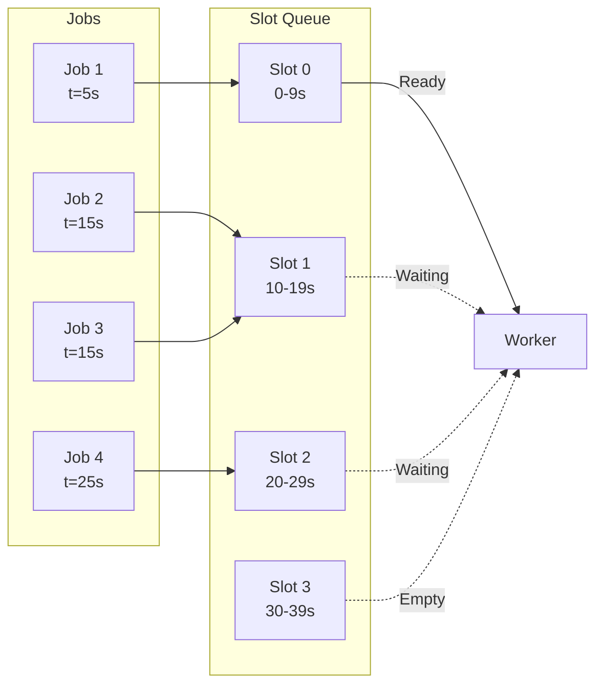

**Components:**
- **SlotQueue**: Min-heap based priority queue
- **PersistentSlotQueue**: Raft-backed slot persistence
- **Worker**: Job execution engine (leader-only)

### 4. Service Discovery

**Location:** `internal/discovery/`

Multiple strategies for cluster formation:

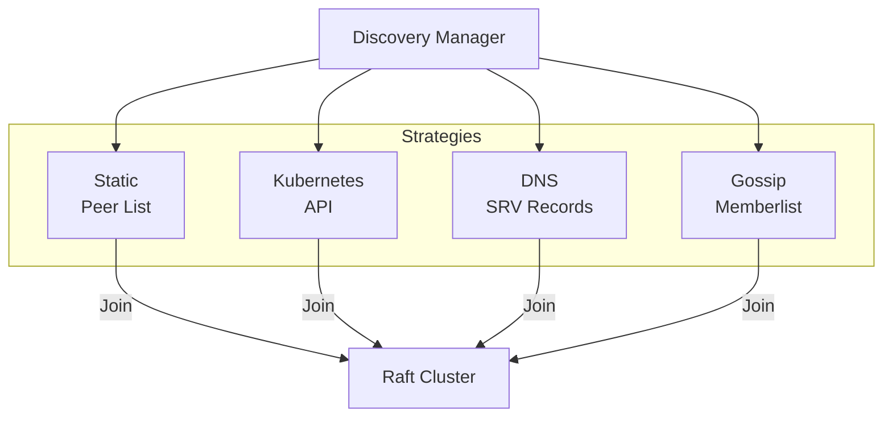

## Data Flow

### Job Creation Flow

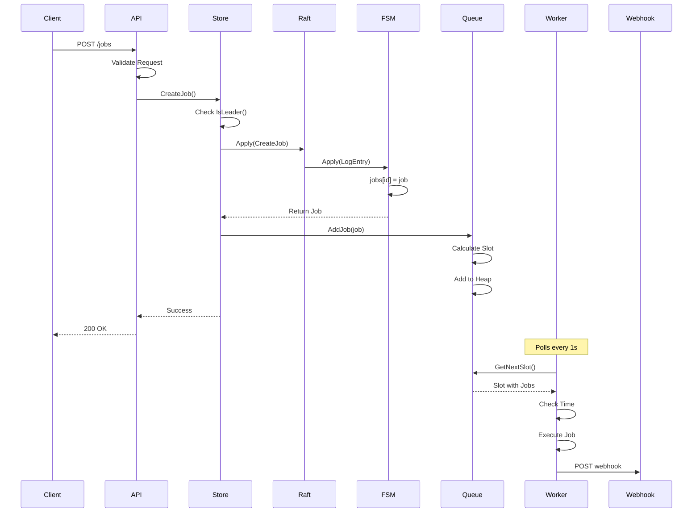

### Job Execution Flow

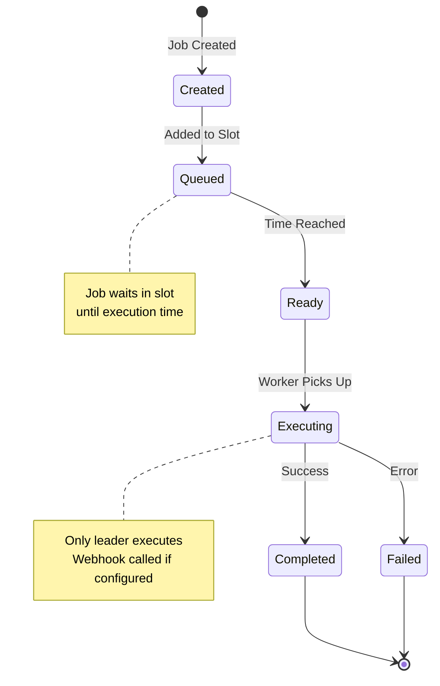

### Recurring Job Flow

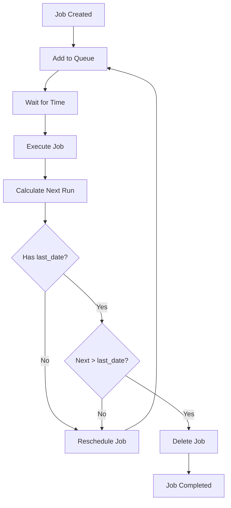

## State Management

### FSM State Structure

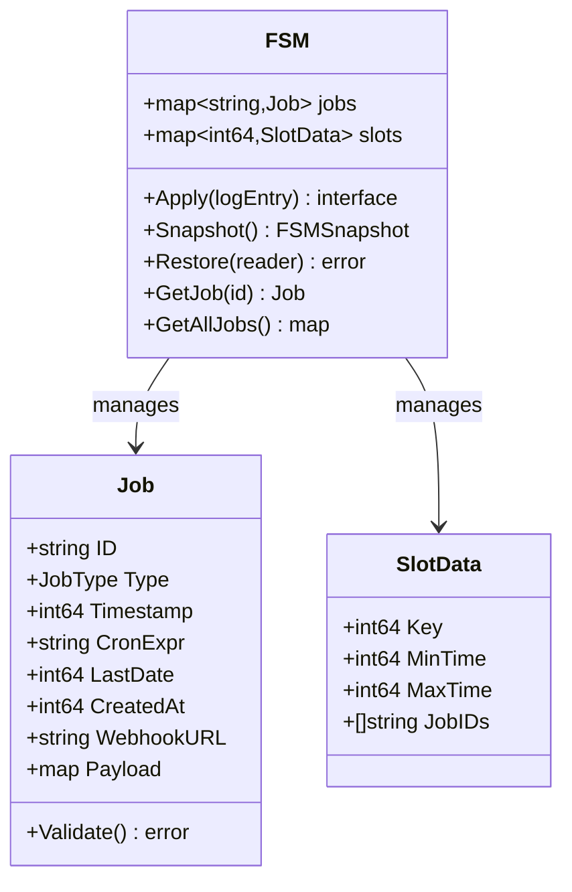

### Snapshot Format

```json
{
  "jobs": {
    "job-id-1": {
      "id": "job-id-1",
      "type": "unico",
      "timestamp": 1704067200,
      "created_at": 1704060000,
      "webhook_url": "https://example.com/webhook"
    }
  },
  "slots": {
    "100": {
      "key": 100,
      "min_time": 1000,
      "max_time": 1099,
      "job_ids": ["job-id-1", "job-id-2"]
    }
  }
}
```

## Leadership and Failover

### Leader Election

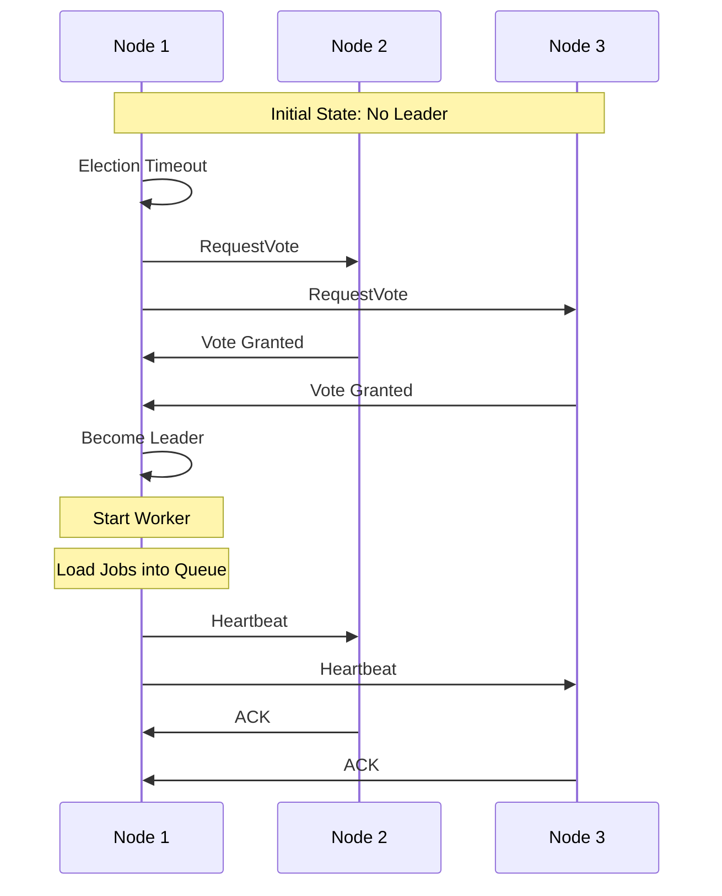

### Graceful Leader Resignation

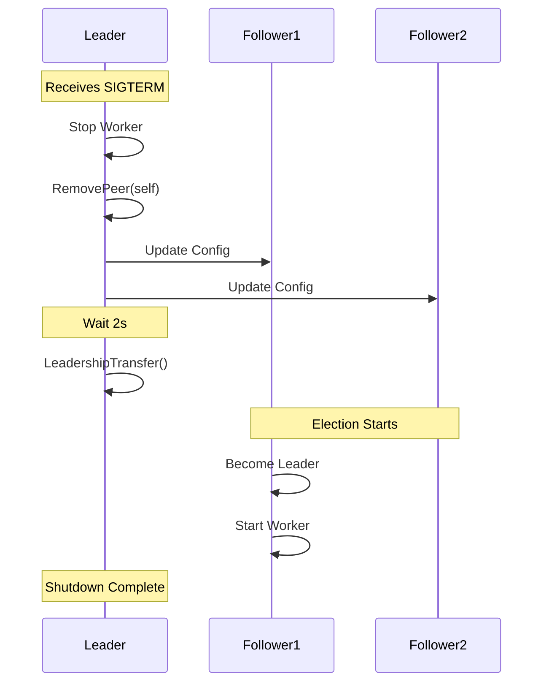

## Deployment Architectures

### Docker Compose (Development)

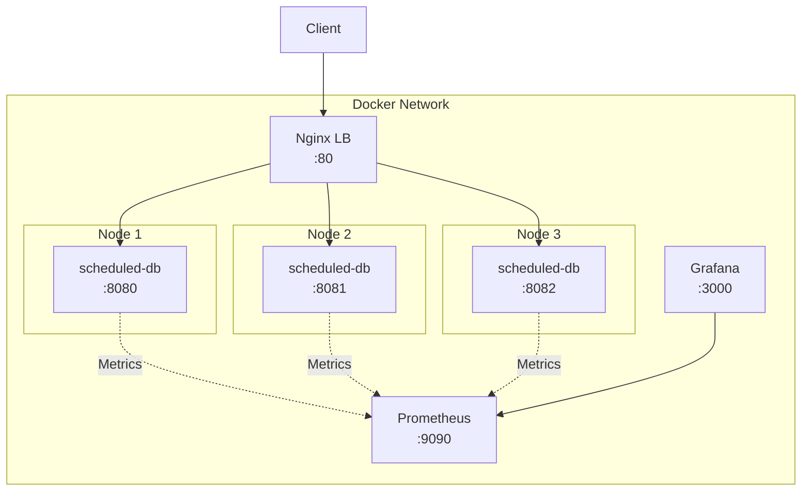

### Kubernetes (Production)

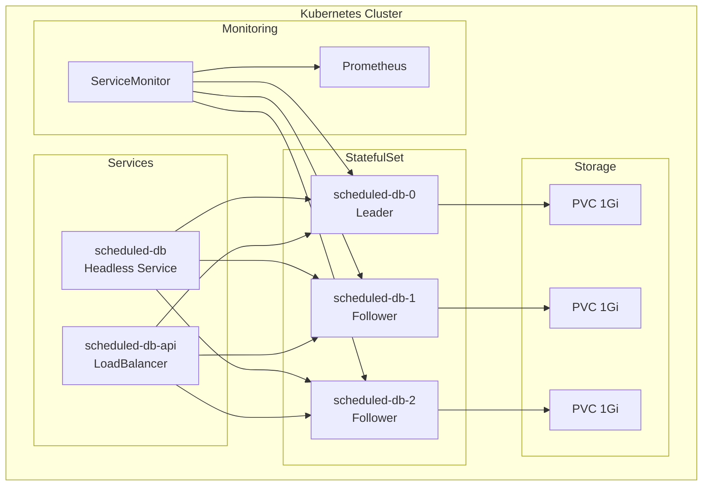

## Performance Characteristics

### Slot-Based Scheduling

- **Slot Gap**: Configurable (default 10s)
- **Slot Calculation**: `slot_key = timestamp / slot_gap`
- **Lookup Complexity**: O(log n) using min-heap
- **Memory**: O(jobs + slots)

### Raft Performance

- **Write Latency**: ~5-10ms (local network)
- **Replication**: Majority quorum (2/3 nodes)
- **Snapshot Frequency**: Configurable
- **Log Compaction**: Automatic

### Scalability

- **Horizontal**: Add more follower nodes
- **Vertical**: Increase resources per node
- **Job Throughput**: ~1000 jobs/sec (single leader)
- **Cluster Size**: Recommended 3-7 nodes

## Security Considerations

### Network Security

- TLS for Raft communication (configurable)
- RBAC for Kubernetes deployments
- Network policies for pod isolation

### Data Security

- Encrypted snapshots (optional)
- Webhook authentication (bearer tokens)
- Audit logging for job operations

### High Availability

- Minimum 3 nodes for quorum
- PodDisruptionBudget in Kubernetes
- Graceful leader resignation
- Split-brain prevention

## Monitoring and Observability

### Metrics Exposed

- Job creation/deletion rates
- Job execution success/failure
- Raft cluster health
- Leader election events
- Slot queue size
- Worker processing time

### Health Endpoints

- `/health` - Node health and role
- `/debug/cluster` - Cluster configuration
- `/metrics` - Prometheus metrics (port 9090)

### Logging Levels

- **DEBUG**: Internal operations, state changes
- **INFO**: Important events, job lifecycle
- **WARN**: Potential issues, degraded performance
- **ERROR**: Failures, critical errors

## References

- [Raft Consensus Algorithm](https://raft.github.io/)
- [HashiCorp Raft Implementation](https://github.com/hashicorp/raft)
- [Kubernetes StatefulSets](https://kubernetes.io/docs/concepts/workloads/controllers/statefulset/)
