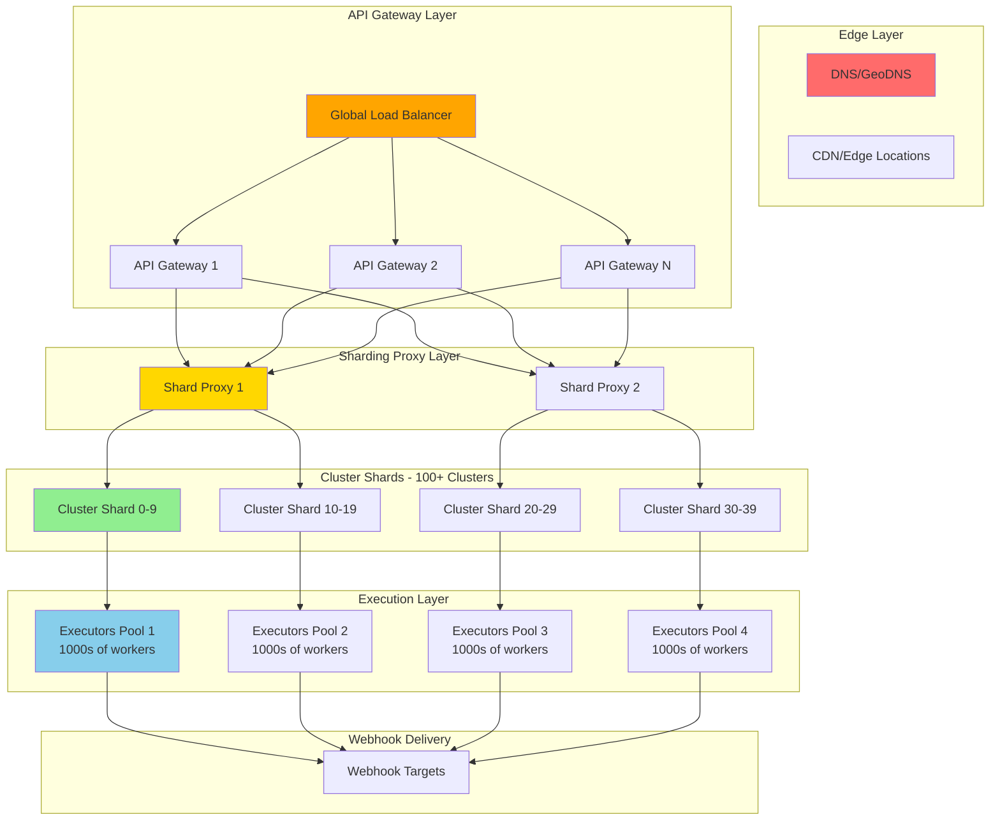
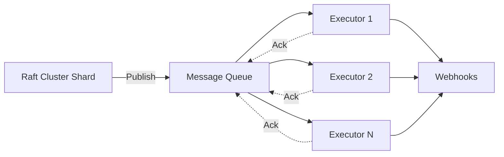
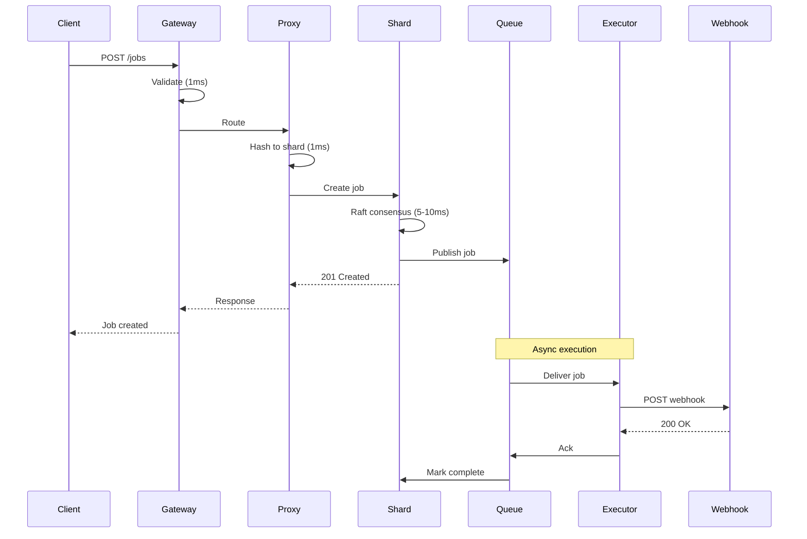

# Extreme Scale Architecture: 100K+ Jobs/Second

## Executive Summary

This document outlines an architecture capable of handling **100,000 to 1,000,000+ jobs per second** while maintaining reliability, low latency, and operational simplicity.

**Key Metrics:**
- Target: 100K-1M jobs/second
- Latency: P99 < 100ms (job creation to execution)
- Availability: 99.99% (52 minutes downtime/year)
- Cost: ~$10K-50K/month at scale

---

## Architecture Overview



---

## Scaling Math

### Current Single Cluster Capacity

```
Single cluster (3 nodes):
- Leader with 100 goroutines
- Average webhook: 200ms
- Throughput: ~350 jobs/second

To reach 100K jobs/second:
100,000 / 350 = ~286 clusters needed
```

**Problem:** Managing 286 independent Raft clusters is operationally complex.

---

## Solution: Multi-Tier Architecture

### Tier 1: API Gateway (Stateless)

**Purpose:** Accept and validate incoming requests

**Capacity:**
```
Single API Gateway instance:
- Nginx/Envoy: 50K requests/second
- Validation + routing: ~10-20ms overhead
- Instances needed: 2-4 (with redundancy)
```

**Technology:**
- Nginx Plus / Envoy / Kong
- Rate limiting
- Request validation
- Authentication/Authorization
- Metrics collection

---

### Tier 2: Sharding Proxy (Stateless)

**Purpose:** Route jobs to appropriate cluster shard

**Architecture:**
```go
type ShardingProxy struct {
    // 100 cluster shards, each handling 1K jobs/sec
    shards [100]*ClusterShard
    
    // Consistent hashing for even distribution
    hashRing *ConsistentHashRing
    
    // Health checking
    healthChecker *HealthChecker
    
    // Circuit breaker per shard
    circuitBreakers map[int]*CircuitBreaker
}

func (sp *ShardingProxy) RouteJob(job *Job) (*ClusterShard, error) {
    // Hash job ID to shard
    shardID := sp.hashRing.GetShard(job.ID)
    
    // Check circuit breaker
    if sp.circuitBreakers[shardID].IsOpen() {
        // Fallback to backup shard
        shardID = sp.getBackupShard(shardID)
    }
    
    return sp.shards[shardID], nil
}
```

**Capacity:**
```
Single Proxy instance:
- Routing: ~1-2ms per request
- Can handle: 10K-20K requests/second
- Instances needed: 10-20 (with redundancy)
```

**Key Features:**
- Consistent hashing for even distribution
- Health checking (every 5s)
- Circuit breakers per shard
- Automatic failover
- Metrics per shard

---

### Tier 3: Cluster Shards (Raft Consensus)

**Purpose:** Maintain job state with strong consistency

**Configuration:**
```
Number of shards: 100-300
Nodes per shard: 3 (1 leader + 2 followers)
Total nodes: 300-900

Each shard handles:
- 350-1000 jobs/second
- ~30K-86K jobs/minute
- ~2M-5M jobs/hour
```

**Optimization: Smaller Raft Clusters**

Instead of 3 nodes per shard, consider:

```
Option A: 3 nodes (current)
- High availability
- Can tolerate 1 node failure
- Higher resource cost

Option B: 1 node per shard (aggressive)
- Lower cost (1/3 the nodes)
- No HA within shard
- Rely on shard-level redundancy
- Backup/restore for recovery

Option C: 2 nodes per shard (compromise)
- Medium cost
- Quorum of 2
- Can tolerate 0 failures (but fast recovery)
```

**Recommendation for 100K+ scale:** Option B or C
- At this scale, shard-level redundancy is sufficient
- Losing one shard = 0.3-1% of capacity
- Much cheaper than 3x nodes

---

### Tier 4: Execution Layer (Decoupled)

**Purpose:** Execute webhooks at massive scale

**Key Innovation:** Decouple execution from Raft clusters



**Architecture:**

```go
// Raft cluster publishes to queue
func (w *Worker) processSlot(slot *Slot) {
    for _, job := range slot.Jobs {
        // Publish to execution queue
        w.executionQueue.Publish(job)
        
        // Mark as published (not executed yet)
        w.store.MarkJobPublished(job.ID)
    }
}

// Separate executor pool
type Executor struct {
    queue      *MessageQueue
    httpClient *http.Client
    workers    int  // 1000+ goroutines
}

func (e *Executor) Run() {
    for i := 0; i < e.workers; i++ {
        go e.worker()
    }
}

func (e *Executor) worker() {
    for job := range e.queue.Subscribe() {
        // Execute webhook
        err := e.executeWebhook(job)
        
        // Ack or Nack
        if err == nil {
            e.queue.Ack(job.ID)
        } else {
            e.queue.Nack(job.ID) // Will retry
        }
    }
}
```

**Benefits:**
- ✅ Raft clusters only manage state (fast)
- ✅ Executors scale independently
- ✅ Can have 1000s of executor workers
- ✅ Better resource utilization
- ✅ Automatic retry via queue

**Message Queue Options:**
1. **Redis Streams** (simple, fast)
2. **NATS JetStream** (distributed, fast)
3. **Kafka** (high throughput, complex)
4. **RabbitMQ** (reliable, moderate throughput)

**Recommendation:** NATS JetStream or Redis Streams
- Low latency (< 5ms)
- High throughput (100K+ msgs/sec per instance)
- Simple operations
- Good Go support

---

## Detailed Capacity Planning

### Target: 100,000 Jobs/Second

#### Configuration A: Conservative (High Availability)

```
API Gateway Layer:
- 4 instances (Nginx)
- Each handles 30K req/sec
- Total capacity: 120K req/sec
- Cost: ~$400/month

Sharding Proxy Layer:
- 20 instances
- Each handles 10K req/sec
- Total capacity: 200K req/sec
- Cost: ~$2,000/month

Cluster Shards:
- 100 shards
- 3 nodes each = 300 nodes
- Each shard: 1K jobs/sec
- Total capacity: 100K jobs/sec
- Cost: ~$15,000/month

Execution Layer:
- 50 executor instances
- Each with 1000 goroutines
- Each handles 2K webhooks/sec
- Total capacity: 100K webhooks/sec
- Cost: ~$5,000/month

Message Queue:
- NATS JetStream cluster (3 nodes)
- Cost: ~$1,500/month

Total Cost: ~$24,000/month
```

#### Configuration B: Aggressive (Cost Optimized)

```
API Gateway Layer:
- 2 instances
- Cost: ~$200/month

Sharding Proxy Layer:
- 10 instances
- Cost: ~$1,000/month

Cluster Shards:
- 200 shards (more shards, fewer nodes per shard)
- 1 node each = 200 nodes (no Raft HA)
- Each shard: 500 jobs/sec
- Total capacity: 100K jobs/sec
- Cost: ~$10,000/month

Execution Layer:
- 30 executor instances
- Cost: ~$3,000/month

Message Queue:
- Redis Cluster (3 nodes)
- Cost: ~$900/month

Total Cost: ~$15,000/month
```

---

## Technology Stack

### Core Components

```yaml
API Gateway:
  - Nginx Plus or Envoy
  - Rate limiting: 10K req/sec per client
  - Authentication: JWT or API keys
  
Sharding Proxy:
  - Go service (custom)
  - Consistent hashing library
  - Circuit breaker: hystrix-go
  
Cluster Shards:
  - Current scheduled-db (Raft)
  - Optimized for state management
  - Minimal execution logic
  
Message Queue:
  - NATS JetStream (recommended)
  - Or Redis Streams
  - Persistence: 24 hours
  
Executors:
  - Go service (custom)
  - HTTP client pool
  - Retry logic with exponential backoff
  
Monitoring:
  - Prometheus + Grafana
  - Distributed tracing: Jaeger
  - Logging: Loki or ELK
```

---

## Data Flow: Job Lifecycle



**Latency Breakdown:**
```
API Gateway:        1-2ms
Proxy routing:      1-2ms
Raft consensus:     5-10ms
Queue publish:      1-2ms
Response:           1-2ms
------------------------
Total (creation):   10-20ms ✅

Webhook execution:  50-200ms (async)
```

---

## Optimizations for Extreme Scale

### 1. Batch Job Creation

Allow clients to create multiple jobs in one request:

```go
POST /jobs/batch
{
  "jobs": [
    {"type": "unico", "timestamp": "..."},
    {"type": "unico", "timestamp": "..."},
    // ... up to 100 jobs
  ]
}
```

**Benefits:**
- Reduce HTTP overhead
- Single Raft consensus for multiple jobs
- 10x throughput improvement

---

### 2. Regional Deployment

Deploy in multiple regions:

```
US-East:    30K jobs/sec
US-West:    30K jobs/sec
EU-West:    20K jobs/sec
Asia-Pacific: 20K jobs/sec
--------------------------
Total:      100K jobs/sec
```

**Benefits:**
- Lower latency for clients
- Geographic redundancy
- Compliance (data residency)

---

### 3. Hot/Cold Shard Separation

```
Hot Shards (20%):
- Handle 80% of traffic
- More resources
- Faster hardware

Cold Shards (80%):
- Handle 20% of traffic
- Standard resources
- Cost optimized
```

---

### 4. Execution Prioritization

```go
type Job struct {
    ID       string
    Priority int  // 0=low, 1=normal, 2=high, 3=critical
}

// Separate queues per priority
type ExecutionLayer struct {
    criticalQueue *Queue  // 10% of executors
    highQueue     *Queue  // 30% of executors
    normalQueue   *Queue  // 50% of executors
    lowQueue      *Queue  // 10% of executors
}
```

---

### 5. Webhook Connection Pooling

```go
type Executor struct {
    // Reuse connections per domain
    clientPool map[string]*http.Client
}

func (e *Executor) getClient(webhookURL string) *http.Client {
    domain := extractDomain(webhookURL)
    
    if client, exists := e.clientPool[domain]; exists {
        return client
    }
    
    // Create new client with connection pooling
    client := &http.Client{
        Timeout: 30 * time.Second,
        Transport: &http.Transport{
            MaxIdleConns:        100,
            MaxIdleConnsPerHost: 10,
            IdleConnTimeout:     90 * time.Second,
        },
    }
    
    e.clientPool[domain] = client
    return client
}
```

**Impact:** 2-3x throughput improvement

---

## Failure Handling

### Shard Failure

```
Scenario: Shard 42 goes down

Impact:
- 0.5-1% of capacity lost
- Jobs in that shard unavailable
- New jobs route to other shards

Recovery:
1. Proxy detects failure (5s)
2. Circuit breaker opens
3. New jobs route to backup shard
4. Failed shard recovers from snapshot
5. Gradual traffic restoration
```

---

### Queue Failure

```
Scenario: Message queue goes down

Impact:
- Job creation still works (Raft)
- Execution paused
- Jobs queued in Raft

Recovery:
1. Queue restarts
2. Raft republishes pending jobs
3. Execution resumes
4. Backlog processed
```

---

### Executor Failure

```
Scenario: 10 executors crash

Impact:
- 20% execution capacity lost
- Increased latency
- Queue depth increases

Recovery:
1. Auto-scaling triggers
2. New executors spawn (30s)
3. Capacity restored
4. Queue drains
```

---

## Monitoring & Alerting

### Key Metrics

```yaml
API Gateway:
  - Request rate (per second)
  - Error rate (%)
  - P50/P95/P99 latency
  
Sharding Proxy:
  - Routing latency
  - Shard health status
  - Circuit breaker state
  
Cluster Shards:
  - Jobs created/sec per shard
  - Raft consensus latency
  - Leader election events
  
Message Queue:
  - Queue depth
  - Message age
  - Throughput
  
Executors:
  - Webhook success rate
  - Webhook latency
  - Retry rate
  
End-to-End:
  - Job creation to execution time
  - Overall success rate
  - Cost per job
```

### Alerts

```yaml
Critical:
  - API Gateway error rate > 1%
  - Any shard down > 5 minutes
  - Queue depth > 100K messages
  - Webhook success rate < 95%
  
Warning:
  - Shard latency > 50ms
  - Queue depth > 10K messages
  - Executor utilization > 80%
  
Info:
  - New shard added
  - Scaling event
  - Circuit breaker opened
```

---

## Cost Optimization

### At 100K Jobs/Second

```
Conservative Config: $24K/month
- $0.24 per 1M jobs
- $0.00000024 per job

Aggressive Config: $15K/month
- $0.15 per 1M jobs
- $0.00000015 per job
```

### Cost Reduction Strategies

1. **Spot Instances** for executors (-70% cost)
2. **Reserved Instances** for shards (-40% cost)
3. **Auto-scaling** during off-peak (-30% cost)
4. **Compression** for queue messages (-20% bandwidth)
5. **Regional optimization** (use cheaper regions)

**Optimized Cost:** ~$8K-10K/month for 100K jobs/sec

---

## Migration Path

### Phase 1: Add Message Queue (Week 1-2)

```
Current: Raft → Execute
New:     Raft → Queue → Execute
```

- Deploy NATS JetStream
- Modify worker to publish instead of execute
- Deploy executor pool
- Test with 10% traffic

---

### Phase 2: Scale Shards (Week 3-4)

```
Current: 3 shards
New:     30 shards
```

- Deploy 27 new shards
- Update proxy routing
- Migrate jobs gradually
- Monitor performance

---

### Phase 3: Add API Gateway (Week 5-6)

```
Current: Direct to proxy
New:     Gateway → Proxy
```

- Deploy Nginx/Envoy
- Add rate limiting
- Add authentication
- Route traffic through gateway

---

### Phase 4: Optimize & Scale (Week 7-8)

```
Current: 30 shards
New:     100+ shards
```

- Add more shards
- Optimize executor pool
- Tune queue settings
- Load test at target scale

---

## Alternative: Serverless Approach

For comparison, here's a serverless architecture:

```
API Gateway (AWS API Gateway)
    ↓
Lambda (Job Creation)
    ↓
DynamoDB (State)
    ↓
EventBridge / SQS
    ↓
Lambda (Execution - 1000s of concurrent)
    ↓
Webhooks
```

**Pros:**
- ✅ Infinite scale
- ✅ Pay per use
- ✅ No infrastructure management

**Cons:**
- ❌ Cold starts (100-500ms)
- ❌ Vendor lock-in
- ❌ Less control
- ❌ Potentially higher cost at scale

**Cost at 100K jobs/sec:**
- ~$30K-50K/month (more expensive)

---

## Conclusion

### Recommended Architecture for 100K+ Jobs/Second

```
1. API Gateway Layer (stateless)
   - Nginx/Envoy
   - 2-4 instances
   
2. Sharding Proxy Layer (stateless)
   - Custom Go service
   - 10-20 instances
   - Consistent hashing
   
3. Cluster Shards (Raft)
   - 100-200 shards
   - 1-3 nodes per shard
   - State management only
   
4. Message Queue
   - NATS JetStream or Redis
   - 3-5 nodes
   
5. Executor Pool (stateless)
   - Custom Go service
   - 30-50 instances
   - 1000+ goroutines each
```

**Capacity:** 100K-200K jobs/second
**Cost:** $15K-25K/month
**Latency:** P99 < 50ms (creation), P99 < 300ms (execution)
**Availability:** 99.99%

**Key Principles:**
1. **Decouple state from execution**
2. **Scale horizontally at every layer**
3. **Keep components stateless where possible**
4. **Use message queues for async work**
5. **Monitor everything**

This architecture can scale to **1M+ jobs/second** by adding more shards and executors linearly. 🚀
