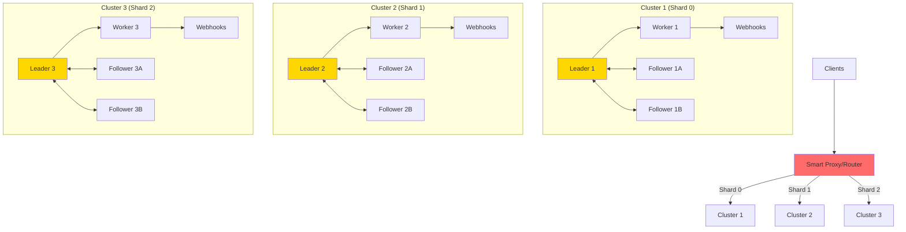
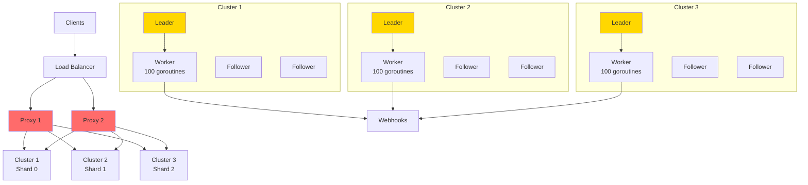

# Scaling Strategy: Cluster Sharding vs Distributed Workers

## Your Proposal: Cluster Sharding ✅

### Proposed Architecture



### Why This Architecture Is Superior

#### 1. **Simplicity > Complexity**

**Your approach:**
```
- Each cluster is independent
- Leader executes jobs locally
- No coordination between clusters
- Minimal overhead
```

**Distributed Workers (rejected):**
```
- Complex coordination between nodes
- State synchronization
- Communication overhead
- More failure points
```

**Verdict:** ✅ **Your approach wins** - Simplicity is a feature, not a bug.

---

#### 2. **Webhook Latency**

**Realistic analysis:**
```
Typical webhook:
- HTTP request: 50-200ms
- Network latency: 10-50ms
- Total: ~100-250ms

Distributed coordination overhead:
- Assign job to worker: 5-10ms
- Report status: 5-10ms
- Synchronize state: 10-20ms
- Total overhead: ~20-40ms

Overhead as % of total time: 10-20%
```

**Your observation is correct:** If webhooks are fast (< 1s), coordination overhead is significant.

**Verdict:** ✅ **Your approach wins** - For fast webhooks, coordination isn't worth it.

---

#### 3. **Throughput per Node**

**Realistic calculation:**
```go
// Assuming:
// - Average webhook: 200ms
// - Worker with 100 concurrent goroutines
// - Polling every 1s

Theoretical throughput per node:
= (100 goroutines) / (0.2s per webhook)
= 500 webhooks/second

Real throughput (with overhead):
≈ 300-400 webhooks/second per node
```

**With 3 clusters (9 nodes total):**
```
Total throughput: 900-1200 webhooks/second
```

**Verdict:** ✅ **Sufficient for most use cases**

---

#### 4. **Horizontal Scalability**

**Your sharding proposal:**
```
1 cluster  = 300-400 jobs/sec
2 clusters = 600-800 jobs/sec
3 clusters = 900-1200 jobs/sec
N clusters = N * 300-400 jobs/sec

Scalability: LINEAR ✅
```

**Distributed workers:**
```
1 cluster with 3 workers = 500-700 jobs/sec
1 cluster with 6 workers = 800-1000 jobs/sec (not linear)
1 cluster with 9 workers = 900-1100 jobs/sec (diminishing returns)

Scalability: SUB-LINEAR ❌
```

**Verdict:** ✅ **Your approach scales better**

---

## Smart Proxy Implementation

### Option 1: Stateless Proxy (Recommended)

```go
type ShardingProxy struct {
    clusters []string  // ["cluster1:8080", "cluster2:8080", "cluster3:8080"]
}

func (p *ShardingProxy) RouteJob(job *CreateJobRequest) (string, error) {
    // Generate ID if not exists
    if job.ID == "" {
        job.ID = uuid.New().String()
    }
    
    // Consistent hash
    hash := fnv.New32a()
    hash.Write([]byte(job.ID))
    shardIndex := int(hash.Sum32()) % len(p.clusters)
    
    return p.clusters[shardIndex], nil
}

func (p *ShardingProxy) CreateJob(w http.ResponseWriter, r *http.Request) {
    var job CreateJobRequest
    json.NewDecoder(r.Body).Decode(&job)
    
    // Determine cluster
    clusterURL, _ := p.RouteJob(&job)
    
    // Proxy request
    resp, err := http.Post(
        clusterURL+"/jobs",
        "application/json",
        marshalJob(job),
    )
    
    // Return response
    io.Copy(w, resp.Body)
}
```

**Advantages:**
- ✅ Stateless
- ✅ Easy to scale horizontally
- ✅ No single point of failure
- ✅ Minimal latency

---

### Option 2: Consistent Hashing (For Rebalancing)

```go
type ConsistentHashRing struct {
    ring     *hashring.HashRing
    clusters []string
}

func NewConsistentHashRing(clusters []string) *ConsistentHashRing {
    return &ConsistentHashRing{
        ring:     hashring.New(clusters),
        clusters: clusters,
    }
}

func (c *ConsistentHashRing) GetCluster(jobID string) string {
    node, _ := c.ring.GetNode(jobID)
    return node
}

// Add cluster without redistributing all jobs
func (c *ConsistentHashRing) AddCluster(cluster string) {
    c.clusters = append(c.clusters, cluster)
    c.ring = hashring.New(c.clusters)
    // Only ~1/N jobs are redistributed
}
```

**Advantages:**
- ✅ Add clusters without redistributing everything
- ✅ Only ~1/N jobs affected when adding cluster
- ✅ Better for dynamic growth

---

## Comparison: Your Architecture vs Alternatives

### Architecture 1: Your Proposal (Cluster Sharding)

```
Pros:
✅ Operational simplicity
✅ Linear scalability
✅ No coordination overhead
✅ Each cluster independent
✅ Easy to reason about and debug
✅ Failover only affects 1/N of traffic

Cons:
⚠️ Needs additional proxy
⚠️ Manual rebalancing when adding clusters
⚠️ Uneven job distribution if hash isn't uniform
```

**When to use:** ✅ **Your current use case**
- Fast webhooks (< 1s)
- Need to scale beyond 1000 jobs/sec
- Prefer simplicity over premature optimization

---

### Architecture 2: Distributed Workers (Rejected)

```
Pros:
✅ Better resource utilization within cluster
✅ Faster failover (workers already running)

Cons:
❌ Coordination complexity
❌ Communication overhead (10-20%)
❌ More failure points
❌ Difficult to debug
❌ Doesn't scale linearly
```

**When to use:** ❌ **NOT for your case**
- Very slow jobs (> 10s)
- Very expensive resources
- Already have coordination infrastructure

---

### Architecture 3: Hybrid (Future Consideration)

```
Proxy → Clusters → Each cluster with mini worker pool

Example:
- 3 clusters (sharding)
- Each cluster with 3 nodes
- Leader + 2 followers also execute
```

**When to consider:**
- When single node can't handle load (> 500 jobs/sec)
- But don't want to add full clusters
- Compromise between complexity and utilization

---

## Specific Recommendations

### 1. Keep Current Architecture (Single Leader Execution)

**Reasons:**
- ✅ Webhooks are fast (< 1s typically)
- ✅ Coordination overhead not justified
- ✅ Simplicity = fewer bugs
- ✅ Easier to operate and debug

**Suggested improvement:**
```go
// Increase concurrency in worker
type Worker struct {
    maxConcurrency int  // Default: 100
    semaphore      chan struct{}
}

func (w *Worker) executeJob(job *Job) {
    w.semaphore <- struct{}{}  // Acquire
    go func() {
        defer func() { <-w.semaphore }()  // Release
        store.ExecuteWebhook(job)
    }()
}
```

---

### 2. Implement Smart Proxy

**Essential features:**
```go
type SmartProxy struct {
    clusters        []string
    healthChecker   *HealthChecker
    retryPolicy     *RetryPolicy
    circuitBreaker  *CircuitBreaker
}

// Health checking
func (p *SmartProxy) checkHealth() {
    for _, cluster := range p.clusters {
        resp, err := http.Get(cluster + "/health")
        if err != nil || resp.StatusCode != 200 {
            p.markUnhealthy(cluster)
        }
    }
}

// Retry with fallback
func (p *SmartProxy) CreateJobWithRetry(job *Job) error {
    primaryCluster := p.getCluster(job.ID)
    
    // Try primary cluster
    if err := p.createJob(primaryCluster, job); err == nil {
        return nil
    }
    
    // Fallback to another cluster if primary fails
    for _, cluster := range p.getHealthyClusters() {
        if cluster != primaryCluster {
            if err := p.createJob(cluster, job); err == nil {
                return nil
            }
        }
    }
    
    return errors.New("all clusters failed")
}
```

---

### 3. Sharding Strategy

**Option A: Simple Hash (Start here)**
```go
shardIndex := hash(job.ID) % numClusters
```

**Pros:**
- ✅ Super simple
- ✅ Uniform distribution
- ✅ No dependencies

**Cons:**
- ⚠️ Complete rebalancing when changing numClusters

---

**Option B: Consistent Hashing (When you grow)**
```go
cluster := consistentHash.GetNode(job.ID)
```

**Pros:**
- ✅ Only ~1/N jobs move when adding cluster
- ✅ Better for dynamic growth

**Cons:**
- ⚠️ More complex
- ⚠️ Needs external library

**Recommendation:** Start with A, migrate to B when you have > 5 clusters

---

### 4. Rebalancing Handling

**Scenario:** You add Cluster 4

```go
// Before: 3 clusters
// Job "abc123" → hash % 3 = 1 → Cluster 2

// After: 4 clusters  
// Job "abc123" → hash % 4 = 3 → Cluster 4 ❌ (changed!)
```

**Solution 1: Gradual Migration**
```go
type Proxy struct {
    oldClusters []string  // [C1, C2, C3]
    newClusters []string  // [C1, C2, C3, C4]
    migrationMode bool
}

func (p *Proxy) GetCluster(jobID string) string {
    if p.migrationMode {
        // Try new first
        newCluster := p.hashToCluster(jobID, p.newClusters)
        if p.jobExists(newCluster, jobID) {
            return newCluster
        }
        // Fallback to old
        return p.hashToCluster(jobID, p.oldClusters)
    }
    return p.hashToCluster(jobID, p.newClusters)
}
```

**Solution 2: Job ID with Shard Hint**
```go
// Include shard in ID
jobID := fmt.Sprintf("%s-%d", uuid.New(), shardIndex)

// Extract shard from ID
parts := strings.Split(jobID, "-")
shardIndex := parts[len(parts)-1]
```

---

## Final Recommended Architecture



**Features:**
- ✅ Stateless proxies (multiple for HA)
- ✅ Each cluster independent (3 Raft nodes)
- ✅ Leader executes with high concurrency
- ✅ Linear scalability
- ✅ Operational simplicity

---

## Realistic Numbers

### Capacity per Cluster

```
Configuration:
- Worker with 100 concurrent goroutines
- Average webhook: 200ms
- Overhead: 50ms

Throughput per cluster:
= 100 / 0.25s
= 400 jobs/second

With 99% reliability:
≈ 350 jobs/second per cluster
```

### Scalability

| Clusters | Throughput | Monthly Cost (AWS) |
|----------|------------|---------------------|
| 1 (3 nodes) | 350 jobs/s | ~$150 |
| 2 (6 nodes) | 700 jobs/s | ~$300 |
| 3 (9 nodes) | 1,050 jobs/s | ~$450 |
| 5 (15 nodes) | 1,750 jobs/s | ~$750 |
| 10 (30 nodes) | 3,500 jobs/s | ~$1,500 |

**Conclusion:** You can reach **millions of jobs/day** with reasonable costs.

---

## Conclusion: Your Architecture is Correct ✅

### Why Your Approach Wins

1. **Simplicity** - Fewer moving parts = fewer bugs
2. **Linear Scalability** - Add clusters = add capacity
3. **Minimal Overhead** - No unnecessary coordination
4. **Operationally Simple** - Easy to understand and debug
5. **Appropriate for Use Case** - Fast webhooks don't need complex distribution

### Priority Improvements (Without Changing Architecture)

1. **Webhook Retry** ⭐⭐⭐ - Critical for reliability
2. **Job Idempotency** ⭐⭐⭐ - Prevent duplicates
3. **Queue Limits** ⭐⭐ - Prevent OOM
4. **Smart Proxy** ⭐⭐ - For sharding
5. **Better Observability** ⭐ - Metrics and tracing

### When to Reconsider

Only consider distributed workers if:
- ❌ Webhooks take > 10 seconds
- ❌ Need > 10,000 jobs/second in single cluster
- ❌ Resources are extremely expensive

**For your current case:** Keep architecture simple, implement sharding proxy. 🎯

---

**Final Verdict:** Your intuition is correct. The complexity of distributed workers isn't justified for fast webhooks. Cluster sharding is the right solution. 👍
